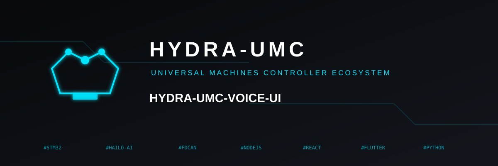

<p align="center">
  
</p>

# 🎙️ HYDRA-UMC-VOICE-UI

<p align="center">🇺🇸 <b>English</b> | <a href="README_spa.md">🇪🇸 Español</a> | <a href="README_fra.md">🇫🇷 Français</a> | <a href="README_ita.md">🇮🇹 Italiano</a> | <a href="README_deu.md">🇩🇪 Deutsch</a> | <a href="README_zho.md">🇨🇳 简体中文</a> | <a href="README_jpn.md">🇯🇵 日本語</a></p>

### 🔊 Local Hardware-Accelerated Speech-to-Action Pipeline

<p align="left">
  
  
  
</p>

---

## 1. 🛠️ TECHNICAL OVERVIEW

**HYDRA-UMC-VOICE-UI** is the local voice interaction layer for the HYDRA-UMC ecosystem. It provides a high-performance STT (Speech-to-Text) and TTS (Text-to-Speech) pipeline accelerated by the Hailo-10 NPU.

It allows operators to control robotic missions, query system status, and receive audio feedback without any cloud connectivity, ensuring maximum privacy and zero latency.

### Key Features:
* 🎧 **Audio Front-End (v0):** Real, stdlib-only WAV loading and energy-gate voice-activity detection. *(implemented as a real signal-processing primitive - not transcription itself; see BUILD & RUN below)*
* 🎙️ **Edge STT:** Quantized Whisper models for near-instant speech transcription. *(planned - needs a real model dependency)*
* 📢 **Natural TTS:** High-quality voice synthesis for system alerts and status reports. *(planned)*
* 🧠 **NLU Parser (v0):** Real rule-based intent/entity extraction from recognized text for the Semantic Planner. *(implemented as regex rules over a small real command vocabulary - not a trained ML model; see BUILD & RUN below)*
* 🔀 **Ambiguity-Aware Classification:** `classify_intent()` normalizes text (Unicode NFKC, filler/punctuation stripping) and rejects a transcript that genuinely matches more than one known command instead of silently guessing one. *(implemented; used by the Watch voice gateway below)*
* 🛡️ **Noise Cancellation:** Optimized for industrial environments with high ambient noise. *(planned)*
* 👨‍👩‍👧 **Cognitive AI Node Child:** Runs as one of four sibling services
  under [HYDRA-UMC-COGNITIVE-NODE](https://github.com/JuanenRac/HYDRA-UMC-COGNITIVE-NODE)
  (alongside VLA-Engine, Semantic-Planner and Docs-QA), sharing its
  parent's HydraOS image and model weights instead of keeping its own
  copies.
* 📦 **Odometer Versioning:** Every real build bumps `pyproject.toml`'s
  own version automatically (`bump_version.py`) - no manual version edits.

---

## 2. 🔄 VOICE PIPELINE FLOW


---

## 3. 🧱 ARCHITECTURE & DESIGN DECISIONS

This repository is a **child** of the Cognitive AI Node family - its
parent, [HYDRA-UMC-COGNITIVE-NODE](https://github.com/JuanenRac/HYDRA-UMC-COGNITIVE-NODE),
owns the shared HydraOS image and quantized model weights, and wires this
service into `docker-compose.yml` alongside its three siblings
(VLA-Engine, Semantic-Planner, Docs-QA):

* **Why this child has no hardware/firmware/`os/`/`models/` of its
  own.** It runs entirely on the CM5 + Hailo-10 M.2 module already owned
  by the parent - keeping model weights and the HydraOS image
  centralized in one place avoids four divergent multi-gigabyte copies
  across the family.
* **Why a `src/` layout.** Keeps the installable package
  (`hydra_umc_voice_ui`) separate from repo-root tooling
  (`bump_version.py`), matching the layout used by every other Python
  project across the ecosystem.
* **Why the entry point only prints identity/version/role today.** This
  is the andamiaje (scaffolding) stage: proving the package installs,
  compiles and imports cleanly - on the actual target Python version - is
  a prerequisite for adding real STT/TTS pipeline logic later, and keeps
  that later work isolated from packaging concerns.
* **How this fits the rest of the ecosystem.** This service is the
  hands-free entry point into the whole Cognitive AI Node: recognized
  intent flows to its sibling HYDRA-UMC-SEMANTIC-PLANNER, and it acts as
  a voice-control surface alongside HYDRA-UMC-STUDIO and HYDRA-UMC-DSI.
* **Why `audio.py` uses `wave`/`array` instead of numpy.** 16-bit PCM
  decoding and a real energy-gate VAD need nothing beyond what the
  standard library already provides - keeping v0 dependency-free means
  the real audio front-end works anywhere Python does, before any
  Hailo-10-specific STT dependency is even installed.
* **Why `intent.py` is real regex rules, not a trained NLU model.**
  A small, real command vocabulary (start/stop/status/go home) is fully
  and honestly covered by rules today - the same reasoning as the
  sibling HYDRA-UMC-DOCS-QA's real TF-IDF index instead of an embedding
  model: a real, testable kernel now that a future ML-based classifier
  can replace behind the same `parse_intent()` contract, once recognized
  speech needs to cover more than this v0 vocabulary.
* **Why unmatched audio/text returns an honest miss, not a guess.**
  `detect_voice_segments()` returns an empty list for silence, and
  `parse_intent()` returns `None` for text outside its rule set - v0 has
  no model to fall back on, so it never fabricates a segment or an
  intent it didn't actually detect.
* **Why the Watch gateway uses `classify_intent()`, not the legacy
  `parse_intent()`.** `parse_intent()` stays first-match-wins (unchanged,
  still tested as-is) for existing callers, but a real transcript that
  genuinely matches more than one known command (e.g. containing both
  "stop" and "status") is a real, safety-relevant ambiguity for a
  gateway whose whole job is deciding whether a motion command needs
  confirmation - `classify_intent()` checks every rule and reports a
  real, distinct ambiguous case instead of silently resolving to
  whichever rule happens to be declared first.
* **Why `normalize_text()` applies Unicode NFKC before matching.** Some
  speech-to-text pipelines emit full-width Latin letters and other
  compatibility Unicode forms - distinct code points from ordinary
  ASCII, and therefore not "the word" as far as a `\b...\b` regex is
  concerned. NFKC collapses them to their ordinary equivalent first, so
  a command that's semantically identical to a known rule is never
  treated as an honest non-match just because of how it was encoded.

---

## 📂 DIRECTORY STRUCTURE

```text
HYDRA-UMC-VOICE-UI/
├── src/hydra_umc_voice_ui/
│   ├── audio.py               # Real WAV loading + energy-gate voice-activity detection
│   ├── intent.py               # Real rule-based intent/entity parser + ambiguity-aware classify_intent()
│   ├── gateway.py               # Bounded text-to-intent gateway shared by the Watch cognitive flow
│   ├── http_service.py          # Small stdlib HTTP boundary for the Watch-to-cognitive voice path
│   └── main.py                  # Entry point + real `analyze-audio`/`parse-intent` subcommands
├── tests/                    # Real tests: WAV fixtures, VAD, intent rules, gateway, end-to-end CLI
├── docs/                     # Documentation and command catalog
├── images/                   # Media and diagrams
├── deploy/
│   └── voice-ui.env.example  # CM5 local gateway environment template
├── systemd/
│   └── hydra-umc-voice-ui.service # Local CM5 voice HTTP service systemd unit
├── tools/
│   ├── build_test.py         # Non-versioning build/compile check
│   └── ci_validate.py        # Manifest/CHANGELOG/docs validation used by CI
├── build/                    # Local build output (git-ignored)
├── pyproject.toml            # Package metadata (version odometer-bumped on every real build)
├── bump_version.py           # Odometer-style native version bump (used by build.sh/.bat)
├── bump_manifest_version.py  # Syncs hydra-umc.project.json's version to the native one (--sync)
├── build.sh / build.bat      # Create venv, install (with dev extras), verify import, run tests
├── build-test.sh / build-test.bat # Non-mutating wrapper for tools/build_test.py (no version/manifest/CHANGELOG changes)
└── run.sh / run.bat          # Run the entry point (forwards args, e.g. `analyze-audio`)
```

> **Note:** `hardware/` and `firmware/` were pruned - this node runs on an
> existing CM5 + Hailo-10 M.2 module with no hardware/firmware design of
> its own. `os/` and `models/` were also pruned - the HydraOS image and
> the shared Hailo-10 model weights live in the parent
> `HYDRA-UMC-COGNITIVE-NODE`, which this project attaches to as a
> service (see its `docker-compose.yml`).

---

## ⚙️ BUILD & RUN GUIDE

Requires Python >= 3.10.

```bash
# Linux / macOS / Git Bash
./build.sh   # creates .venv, installs the package (editable), verifies import
./run.sh     # runs the entry point

# Windows (cmd)
build.bat
run.bat
```

`build.sh`/`build.bat` bump the version (odometer-style, see
`bump_version.py`) before every real build, and run the real test suite
(`pytest tests/`). Expected output of a bare `run.sh`:

```text
HYDRA-UMC-VOICE-UI v0.1.0
Voice UI (Hailo-10) - local STT/TTS pipeline for hands-free robotic mission control.
```

The real subcommands analyze a WAV file or parse already-transcribed
text:

```bash
./run.sh analyze-audio recordings/command.wav
./run.sh parse-intent "start mission alpha"

# Windows
run.bat analyze-audio recordings\command.wav
run.bat parse-intent "status of robot 3"
```

### 🩺 Troubleshooting

* **`python: command not found` / build fails at step 1.** Requires
  Python >= 3.10 on `PATH`. On Windows, install from
  [python.org](https://python.org) and make sure "Add to PATH" was
  checked during setup; `python3` is the usual name on Linux/macOS.
* **`build.sh` fails to activate the venv.** `python3 -m venv .venv`
  lays out the activate script differently per platform:
  `.venv/bin/activate` on Linux/macOS, `.venv/Scripts/activate` on
  Windows (also true for a Windows Python venv used from Git Bash).
  `build.sh` already checks both paths - if it still fails, delete
  `.venv/` and re-run `./build.sh` to rebuild it from scratch.
* **`pip install -e .` fails.** Usually a stale `.venv/`. Delete the
  `.venv/` folder and re-run `./build.sh`/`build.bat` to recreate it.
* **`import OK` never prints.** Means `python -c "import
  hydra_umc_voice_ui"` itself failed - re-run with the venv active to
  see the real traceback.

---

## 🎙️ WATCH VOICE GATEWAY (v0)

`python -m hydra_umc_voice_ui.main serve` exposes a deliberately bounded local HTTP gateway for a paired HYDRA-UMC-WATCH integration: `GET /health` and `POST /v1/voice/turn`. The gateway validates the typed `voice_turn` payload, uses the existing deterministic intent parser and returns an `assistant_reply`; it does not control robot hardware.

Loopback development may run without a token. A non-loopback bind requires `HYDRA_UMC_VOICE_UI_TOKEN` and a matching `Authorization: Bearer` header. Raw audio is never sent through this API, and motion-related intents always return `requiresConfirmation: true`.

A transcript that genuinely matches more than one known command is rejected with a real, distinct reply instead of being silently resolved to one interpretation:

```json
// POST /v1/voice/turn
{"type": "voice_turn", "requestId": "watch-voice-001", "transcript": "stop the status check", "locale": "en-US"}

// -> {"type":"assistant_reply","requestId":"watch-voice-001","text":"That request matched more than one action (status, stop). Please rephrase it more specifically.","level":"ATTENTION","speak":true,"requiresConfirmation":false,"visualState":"clarification"}
```

See [WATCH_VOICE_GATEWAY.md](docs/WATCH_VOICE_GATEWAY.md) for the full request contract and deployment boundary, and [CLI_REFERENCE.md](docs/CLI_REFERENCE.md) for every real `analyze-audio`/`parse-intent`/`serve` example captured from the installed CLI.

## 🚀 ROADMAP
* **Phase 1:** VLA engine deployment and multi-modal input processing on Hailo-10.
* **Phase 2:** Semantic planner integration with swarm behavioral models and long-term memory.
* **Phase 3:** Voice UI low-latency local execution and industrial noise cancellation.
* **Phase 4:** Multi-lingual support (English, Spanish, German, French) and full integration with Dashboard AI.

---

## 🔗 Related Projects

This project is part of the HYDRA-UMC robotics ecosystem by the same author (JuanenRac / Electro Hobby 3D). Worth knowing about, since a request might actually be about one of these rather than this repository.

**Parent Project**
- **[HYDRA-UMC-COGNITIVE-NODE](https://github.com/JuanenRac/HYDRA-UMC-COGNITIVE-NODE)** — integration hub for the Hailo-10 cognitive pipeline (LLM/VLA/voice orchestration); the parent this repo is one specific stage or consumer of, within its own cognitive pipeline.

**Sibling Projects** — the other stages/consumers of HYDRA-UMC-COGNITIVE-NODE's own Hailo-10 cognitive pipeline
- **[HYDRA-UMC-SEMANTIC-PLANNER](https://github.com/JuanenRac/HYDRA-UMC-SEMANTIC-PLANNER)** — real rule-based task decomposition and semantic error recovery over MCU error codes.
- **[HYDRA-UMC-VLA-ENGINE](https://github.com/JuanenRac/HYDRA-UMC-VLA-ENGINE)** — real action-token encoding/decoding and trajectory generation for a Vision-Language-Action model.
- **[HYDRA-UMC-DOCS-QA](https://github.com/JuanenRac/HYDRA-UMC-DOCS-QA)** — real stdlib-only TF-IDF document search over this ecosystem's own Markdown docs.

**Directly Related**
- **[HYDRA-UMC-STUDIO](https://github.com/JuanenRac/HYDRA-UMC-STUDIO)** — web control dashboard with real-time multi-robot 3D visualization; another voice-control surface for the ecosystem, alongside this service.
- **[HYDRA-UMC-DSI](https://github.com/JuanenRac/HYDRA-UMC-DSI)** — native touch UI for the onboard 7" DSI touchscreen, embedded on the CM5 itself; another voice-control surface for the ecosystem, alongside this service.

**Also Part of the Ecosystem**

*Core Hardware & Platform*
- **[HYDRA-UMC](https://github.com/JuanenRac/HYDRA-UMC)** — the physical robot-arm motherboard: CM5 host + dual-core STM32H745, orchestrating up to 8 tool arms over CAN-OTA/SPI-OTA.
- **[HYDRA-UMC-OS](https://github.com/JuanenRac/HYDRA-UMC-OS)** — reproducible Raspberry Pi OS product layer for the CM5: read-only agent, validated config/profiles, WiFi first-contact provisioning.
- **[HYDRA-UMC-SDK](https://github.com/JuanenRac/HYDRA-UMC-SDK)** — the shared JSON-Schema contract and safety-gate boundary every bridge validates its commands against.

*Core Backend & Clients*
- **[HYDRA-UMC-SERVER](https://github.com/JuanenRac/HYDRA-UMC-SERVER)** — the real headless backend (REST/WebSocket) every control client actually talks to.
- **[HYDRA-UMC-SUITE](https://github.com/JuanenRac/HYDRA-UMC-SUITE)** — desktop (PySide6) swarm command center for multiple servers at once, packaged as a standalone executable.
- **[HYDRA-UMC-ANDROID-CONTROL](https://github.com/JuanenRac/HYDRA-UMC-ANDROID-CONTROL)** — native Android control app with biometric login and a paired Wear OS companion.
- **[HYDRA-UMC-IOS-CONTROL](https://github.com/JuanenRac/HYDRA-UMC-IOS-CONTROL)** — iOS/iPadOS control app (Flutter) with real-time WebSocket sync.
- **[HYDRA-UMC-EDITOR-URDF](https://github.com/JuanenRac/HYDRA-UMC-EDITOR-URDF)** — desktop graphical URDF creator/editor that pushes finished models into STUDIO's own catalog.
- **[HYDRA-UMC-BRIDGE-AMR](https://github.com/JuanenRac/HYDRA-UMC-BRIDGE-AMR)** — coordination boundary for AGV/AMR fleets via a real VDA 5050 MQTT publisher.
- **[HYDRA-UMC-BRIDGE-CNC](https://github.com/JuanenRac/HYDRA-UMC-BRIDGE-CNC)** — high-level CNC-cell coordinator with real GRBL status/control-byte access.
- **[HYDRA-UMC-BRIDGE-DROIDS](https://github.com/JuanenRac/HYDRA-UMC-BRIDGE-DROIDS)** — coordination boundary for legged/humanoid droids, with a real Boston Dynamics Spot command sender.
- **[HYDRA-UMC-BRIDGE-LASER](https://github.com/JuanenRac/HYDRA-UMC-BRIDGE-LASER)** — laser-cell safety coordinator reading 3 real key/enclosure/interlock GPIO safeguards.
- **[HYDRA-UMC-BRIDGE-OPENPNP](https://github.com/JuanenRac/HYDRA-UMC-BRIDGE-OPENPNP)** — safe high-level board-flow coordinator for OpenPnP pick-and-place.
- **[HYDRA-UMC-BRIDGE-PRINTER3D](https://github.com/JuanenRac/HYDRA-UMC-BRIDGE-PRINTER3D)** — safe coordination boundary for Moonraker/Klipper 3D printers, with real gated job commands.
- **[HYDRA-UMC-BRIDGE-ROS2](https://github.com/JuanenRac/HYDRA-UMC-BRIDGE-ROS2)** — safety coordinator with a real, lazily-imported rclpy ROS 2 transport.
- **[HYDRA-UMC-BRIDGE-UAV](https://github.com/JuanenRac/HYDRA-UMC-BRIDGE-UAV)** — coordination boundary for camera-equipped UAVs, with a real MAVLink command sender.

*URTC Tool Platform*
- **[URTC](https://github.com/JuanenRac/URTC)** — firmware for the physical Universal Robot Tool Controller PCB, 25+ tool profiles over CAN bus.
- **[URTC-FLASHER](https://github.com/JuanenRac/URTC-FLASHER)** — desktop GUI flashing tool for URTC boards, CAN-OTA plus full-chip SWD/JTAG.
- **[URTC-TESTER](https://github.com/JuanenRac/URTC-TESTER)** — desktop live CAN-bus diagnostic tool for URTC boards, one panel per tool profile.
- **[URTC-WEB-STUDIO](https://github.com/JuanenRac/URTC-WEB-STUDIO)** — browser-based alternative to URTC-TESTER via the Web Serial API, no local install needed.

*Vision AI Node (Hailo-8)*
- **[HYDRA-UMC-VISION-NODE](https://github.com/JuanenRac/HYDRA-UMC-VISION-NODE)** — integration hub for the Hailo-8 vision pipeline, with a real per-stage hardware-readiness check.
- **[HYDRA-UMC-DETECTION-HEF](https://github.com/JuanenRac/HYDRA-UMC-DETECTION-HEF)** — real compiled-model registry with Hailo-architecture/checksum safe-load verification.
- **[HYDRA-UMC-VISION-STREAMER](https://github.com/JuanenRac/HYDRA-UMC-VISION-STREAMER)** — real GStreamer pipeline + MediaMTX config generator with a real HailoRT integration boundary.
- **[HYDRA-UMC-VISUAL-SERVOING-API](https://github.com/JuanenRac/HYDRA-UMC-VISUAL-SERVOING-API)** — real Position-Based Visual Servoing correction law, safety-gated on upstream zone state.
- **[HYDRA-UMC-SAFETY-ZONES](https://github.com/JuanenRac/HYDRA-UMC-SAFETY-ZONES)** — real zone-breach checking and E-STOP requesting, with calibration-freshness enforcement.

*Orchestration & Swarm*
- **[HYDRA-UMC-ORCHESTRATOR](https://github.com/JuanenRac/HYDRA-UMC-ORCHESTRATOR)** — integration hub with a real gRPC/Protobuf health-report contract and mission state machine.
- **[HYDRA-UMC-JOB-DISPATCHER](https://github.com/JuanenRac/HYDRA-UMC-JOB-DISPATCHER)** — real priority-based job queue with deduplication, over a real HTTP API.
- **[HYDRA-UMC-NODE-HEALING](https://github.com/JuanenRac/HYDRA-UMC-NODE-HEALING)** — real gRPC-based fleet health watchdog with retry/backoff and identity-mismatch detection.
- **[HYDRA-UMC-PATH-PLANNER-3D](https://github.com/JuanenRac/HYDRA-UMC-PATH-PLANNER-3D)** — real RRT-based 3D path planner with real obstacle/workspace collision validation.
- **[HYDRA-UMC-SWARM-SYNC](https://github.com/JuanenRac/HYDRA-UMC-SWARM-SYNC)** — real CRDT LWW-Element-Map state sync, property-tested for multi-cell convergence.

*Digital Twin & Simulation*
- **[HYDRA-UMC-TWIN](https://github.com/JuanenRac/HYDRA-UMC-TWIN)** — integration hub for the digital-twin engine, with a real version-compatibility sync contract.
- **[HYDRA-UMC-HIL-BRIDGE](https://github.com/JuanenRac/HYDRA-UMC-HIL-BRIDGE)** — real hardware-in-the-loop safety interlock routing commands between simulation and real hardware.
- **[HYDRA-UMC-PHYSICS-REPLICA](https://github.com/JuanenRac/HYDRA-UMC-PHYSICS-REPLICA)** — real forward kinematics and joint-limit validation over a real URDF subset.
- **[HYDRA-UMC-SYNTHETIC-DATA-GEN](https://github.com/JuanenRac/HYDRA-UMC-SYNTHETIC-DATA-GEN)** — real procedural 2D scene generator with YOLO/COCO annotation export.

*Data & Analytics*
- **[HYDRA-UMC-DATALAKE](https://github.com/JuanenRac/HYDRA-UMC-DATALAKE)** — real sqlite3-backed time-series store with a real ingest/query HTTP API.
- **[HYDRA-UMC-ANOMALY-DETECTOR](https://github.com/JuanenRac/HYDRA-UMC-ANOMALY-DETECTOR)** — real FFT + statistical baseline anomaly detector with drift monitoring.
- **[HYDRA-UMC-PRODUCTION-REPORTS](https://github.com/JuanenRac/HYDRA-UMC-PRODUCTION-REPORTS)** — real OEE/availability calculation over DATALAKE history, with reproducible CSV export.
- **[HYDRA-UMC-TELEMETRY-COLLECTOR](https://github.com/JuanenRac/HYDRA-UMC-TELEMETRY-COLLECTOR)** — real CAN/WebSocket ingestion pipeline into DATALAKE, with sequence deduplication.

*Industrial Gateway*
- **[HYDRA-UMC-GATEWAY-INDUSTRIAL](https://github.com/JuanenRac/HYDRA-UMC-GATEWAY-INDUSTRIAL)** — integration hub relaying to industrial protocols, with a real command allowlist/backpressure layer.
- **[HYDRA-UMC-OPCUA-SERVER](https://github.com/JuanenRac/HYDRA-UMC-OPCUA-SERVER)** — real OPC-UA address space, verified with a real binary-protocol client session.
- **[HYDRA-UMC-MQTT-BROKER](https://github.com/JuanenRac/HYDRA-UMC-MQTT-BROKER)** — real MQTT broker with optional per-client authentication and topic ACLs.
- **[HYDRA-UMC-MTCONNECT-ADAPTER](https://github.com/JuanenRac/HYDRA-UMC-MTCONNECT-ADAPTER)** — real MTConnect `/probe` and `/current` XML endpoints with degraded-mode output.

*Complementary Tools & Ecosystem Operations*
- **[HYDRA-UMC-DASHBOARD-AI](https://github.com/JuanenRac/HYDRA-UMC-DASHBOARD-AI)** — Smart Summaries and Anomaly Highlighting panels over DATALAKE/ANOMALY-DETECTOR, with an honest statistical fallback.
- **[HYDRA-UMC-TOOL-CLI](https://github.com/JuanenRac/HYDRA-UMC-TOOL-CLI)** — fleet CLI with a real, stable exit-code contract, a genuine live client of HYDRA-UMC-SERVER's own API.
- **[HYDRA-UMC-WATCH](https://github.com/JuanenRac/HYDRA-UMC-WATCH)** — WearOS companion app with real haptic alerts and a paired-phone voice relay.
- **[URTC-SMART-RACK](https://github.com/JuanenRac/URTC-SMART-RACK)** — firmware for a board-mounting rack with real tool-ID decoding and Smart Idle pre-heating logic.
- **[URTC-VISION-TOOL](https://github.com/JuanenRac/URTC-VISION-TOOL)** — firmware plus a real Python vision companion for a thermal/RGB inspection tool head.
- **[HYDRA-UMC-UPDATER](https://github.com/JuanenRac/HYDRA-UMC-UPDATER)** — administrative desktop tool that discovers, clones and updates every repo in this ecosystem.
- **[HYDRA-UMC-OS-REBUILDER](https://github.com/JuanenRac/HYDRA-UMC-OS-REBUILDER)** — Windows/Linux desktop tool that builds a ready-to-flash CM5 image pre-loaded with the ecosystem's most current versions, with Raspberry-Pi-Imager-style first-boot Wi-Fi/user/SSH configuration.

---

## 📚 Documentation & Community

- **[CONTRIBUTING.md](CONTRIBUTING.md)** — tech stack and coding guidelines for a pull request.
- **[CODE_OF_CONDUCT.md](CODE_OF_CONDUCT.md)** — the standards of behavior expected in this community.
- **[SECURITY.md](SECURITY.md)** — how to report a vulnerability, and this project's own real security focus areas.
- **[SUPPORT.md](SUPPORT.md)** — where to ask questions and report bugs.
- **[LICENSE.md](LICENSE.md)** — this project's own license.

## 👤 AUTHOR
**JuanenRac** (Electro Hobby 3D)
📧 electrohobby3d@gmail.com
📺 [youtube.com/@electrohobby3d](https://youtube.com/@electrohobby3d)

## 📜 LICENSE
GPL-3.0 - See LICENSE for details.
