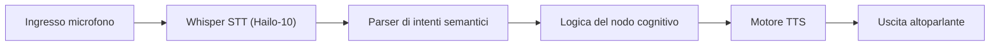

<p align="center">
  
</p>

# 🎙️ HYDRA-UMC-VOICE-UI

<p align="center"><a href="README.md">🇺🇸 English</a> | <a href="README_spa.md">🇪🇸 Español</a> | <a href="README_fra.md">🇫🇷 Français</a> | 🇮🇹 <b>Italiano</b> | <a href="README_deu.md">🇩🇪 Deutsch</a> | <a href="README_zho.md">🇨🇳 简体中文</a> | <a href="README_jpn.md">🇯🇵 日本語</a></p>

### 🔊 Pipeline Speech-to-Action locale accelerata dall'hardware

<p align="left">
  
  
  
</p>

---

## 1. 🛠️ PANORAMICA TECNICA

**HYDRA-UMC-VOICE-UI** è lo strato di interazione vocale locale per l'ecosistema HYDRA-UMC. Fornisce una pipeline STT (Speech-to-Text) e TTS (Text-to-Speech) ad alte prestazioni accelerata dalla NPU Hailo-10.

Consente agli operatori di controllare le missioni robotiche, interrogare lo stato del sistema e ricevere feedback audio senza alcuna connettività cloud, garantendo la massima privacy e latenza zero.

### Caratteristiche principali:
* 🎧 **Front-end audio (v0):** Caricamento WAV reale, solo stdlib, e rilevamento dell'attività vocale tramite soglia di energia. *(implementato come vera primitiva di elaborazione del segnale - non la trascrizione in sé; vedi BUILD ED ESECUZIONE sotto)*
* 🎙️ **Edge STT:** Modelli Whisper quantizzati per una trascrizione vocale quasi istantanea. *(pianificato - richiede una vera dipendenza da modello)*
* 📢 **TTS naturale:** Sintesi vocale di alta qualità per avvisi di sistema e rapporti sullo stato. *(pianificato)*
* 🧠 **Parser NLU (v0):** Estrazione reale di intenti/entità dal testo riconosciuto, basata su regole, per il Semantic Planner. *(implementato come regole regex su un piccolo vocabolario reale di comandi - non un modello ML addestrato; vedi BUILD ED ESECUZIONE sotto)*
* 🔀 **Classificazione consapevole dell'ambiguità:** `classify_intent()` normalizza il testo (Unicode NFKC, rimozione di riempitivi/punteggiatura) e rifiuta una trascrizione che corrisponde realmente a più di un comando noto invece di indovinarne uno in silenzio. *(implementato; usato dal gateway vocale per Watch più sotto)*
* 🛡️ **Cancellazione del rumore:** Ottimizzato per ambienti industriali con elevato rumore ambientale. *(pianificato)*
* 👨‍👩‍👧 **Figlio del Cognitive AI Node:** Gira come uno dei quattro
  servizi fratelli sotto [HYDRA-UMC-COGNITIVE-NODE](https://github.com/JuanenRac/HYDRA-UMC-COGNITIVE-NODE)
  (insieme a VLA-Engine, Semantic-Planner e Docs-QA), condividendo
  l'immagine HydraOS e i pesi dei modelli del padre invece di mantenere
  copie proprie.
* 📦 **Versionamento Contachilometri:** Ogni build reale incrementa
  automaticamente la versione di `pyproject.toml` (`bump_version.py`) -
  nessuna modifica manuale della versione.

---

## 2. 🔄 FLUSSO DELLA PIPELINE VOCALE



---

## 3. 🧱 ARCHITETTURA E DECISIONI DI PROGETTAZIONE

Questo repository è un **figlio** della famiglia Cognitive AI Node - il
suo padre, [HYDRA-UMC-COGNITIVE-NODE](https://github.com/JuanenRac/HYDRA-UMC-COGNITIVE-NODE),
possiede l'immagine HydraOS condivisa e i pesi dei modelli quantizzati, e
collega questo servizio nel suo `docker-compose.yml` insieme ai suoi tre
fratelli (VLA-Engine, Semantic-Planner, Docs-QA):

* **Perché questo figlio non ha hardware/firmware/`os/`/`models/`
  propri.** Gira interamente sul modulo CM5 + Hailo-10 M.2 già posseduto
  dal padre - centralizzare i pesi dei modelli e l'immagine HydraOS in un
  unico posto evita quattro copie divergenti di più gigabyte all'interno
  della famiglia.
* **Perché una struttura `src/`.** Mantiene il pacchetto installabile
  (`hydra_umc_voice_ui`) separato dal tooling nella radice del repo
  (`bump_version.py`), coerentemente con il resto dei progetti Python
  dell'ecosistema.
* **Perché il punto di ingresso oggi si limita a stampare
  identità/versione/ruolo.** Questa è la fase di andamiaje
  (impalcatura): dimostrare che il pacchetto si installa, compila e
  importa correttamente - sulla versione Python reale di destinazione -
  è un prerequisito prima di aggiungere la vera logica della pipeline
  STT/TTS, e mantiene quel lavoro successivo isolato dalle questioni di
  packaging.
* **Come si inserisce nel resto dell'ecosistema.** Questo servizio è il
  punto di ingresso a mani libere per l'intero Cognitive AI Node:
  l'intento riconosciuto fluisce verso il suo fratello
  HYDRA-UMC-SEMANTIC-PLANNER, e agisce come superficie di controllo
  vocale insieme a HYDRA-UMC-STUDIO e HYDRA-UMC-DSI.
* **Perché `audio.py` usa `wave`/`array` invece di numpy.** La
  decodifica PCM a 16 bit e una vera VAD a soglia di energia non
  richiedono nulla oltre quanto la stdlib già offre - mantenere v0 privo
  di dipendenze significa che il vero front-end audio funziona ovunque
  giri Python, ancora prima che venga installata qualsiasi dipendenza
  STT specifica per Hailo-10.
* **Perché `intent.py` sono vere regole regex, non un modello NLU
  addestrato.** Un piccolo vocabolario reale di comandi
  (start/stop/status/go home) è coperto interamente e onestamente da
  regole oggi - lo stesso ragionamento del vero indice TF-IDF del
  fratello HYDRA-UMC-DOCS-QA invece di un modello di embedding: un
  nucleo reale e testabile ora, che un futuro classificatore basato su
  ML potrà sostituire dietro lo stesso contratto `parse_intent()`,
  quando il parlato riconosciuto dovrà coprire più di questo vocabolario
  v0.
* **Perché audio/testo senza corrispondenze restituisce un fallimento
  onesto, non una supposizione.** `detect_voice_segments()` restituisce
  una lista vuota per il silenzio, e `parse_intent()` restituisce `None`
  per testo fuori dal suo insieme di regole - v0 non ha un modello di
  riserva, quindi non inventa mai un segmento o un intento che non ha
  realmente rilevato.
* **Perché il gateway Watch usa `classify_intent()`, non il
  `parse_intent()` legacy.** `parse_intent()` resta "vince la prima
  corrispondenza" (invariato, ancora testato così com'è) per i chiamanti
  esistenti, ma una trascrizione reale che corrisponde realmente a più
  di un comando noto (ad esempio contenente sia "stop" che "status") è
  un'ambiguità reale e rilevante per la sicurezza in un gateway il cui
  unico compito è decidere se un comando di movimento richiede conferma
  - `classify_intent()` controlla ogni regola e segnala un caso di
  ambiguità reale e distinto invece di risolverlo silenziosamente verso
  qualunque regola sia dichiarata per prima.
* **Perché `normalize_text()` applica Unicode NFKC prima della
  corrispondenza.** Alcune pipeline di speech-to-text emettono lettere
  latine a larghezza intera e altre forme Unicode di compatibilità -
  punti di codice distinti dall'ASCII ordinario, e quindi non "la
  parola" per quanto riguarda un'espressione regolare `\b...\b`. NFKC
  li riduce prima al loro equivalente ordinario, così un comando
  semanticamente identico a una regola nota non viene mai trattato come
  un fallimento onesto solo per come è stato codificato.

---

## 📂 STRUTTURA DELLE CARTELLE

```text
HYDRA-UMC-VOICE-UI/
├── src/hydra_umc_voice_ui/
│   ├── audio.py               # Caricamento WAV reale + rilevamento attività vocale per energia
│   ├── intent.py               # Parser reale di intenti/entità basato su regole + classify_intent() consapevole dell'ambiguità
│   ├── gateway.py               # Gateway testo-a-intento limitato, condiviso dal flusso cognitivo di Watch
│   ├── http_service.py          # Piccolo confine HTTP stdlib per il percorso vocale Watch-a-cognitive
│   └── main.py                  # Punto di ingresso + sottocomandi reali `analyze-audio`/`parse-intent`
├── tests/                    # Test reali: fixture WAV, VAD, regole di intento, gateway, CLI end-to-end
├── docs/                     # Documentazione e catalogo dei comandi
├── images/                   # Media e diagrammi
├── deploy/
│   └── voice-ui.env.example  # Modello di ambiente del gateway locale sulla CM5
├── systemd/
│   └── hydra-umc-voice-ui.service # Unità systemd del servizio HTTP vocale locale sulla CM5
├── tools/
│   ├── build_test.py         # Controllo build senza versionamento
│   └── ci_validate.py        # Validazione manifest/CHANGELOG/docs usata dalla CI
├── build/                    # Output di build locale (ignorato da git)
├── pyproject.toml            # Metadati del pacchetto (versione a incremento contachilometri)
├── bump_version.py           # Incremento versione nativa stile contachilometri (usato da build.sh/.bat)
├── bump_manifest_version.py  # Sincronizza la versione di hydra-umc.project.json con quella nativa (--sync)
├── build.sh / build.bat      # Crea il venv, installa (con extra dev), verifica l'import, esegue i test
├── build-test.sh / build-test.bat # Wrapper non-mutante per tools/build_test.py (non tocca versione/manifest/CHANGELOG)
└── run.sh / run.bat          # Esegue il punto di ingresso (inoltra gli argomenti, es. `analyze-audio`)
```

> **Nota:** `hardware/` e `firmware/` sono stati potati - questo nodo
> funziona su un modulo CM5 + Hailo-10 M.2 già esistente, senza un
> progetto hardware/firmware proprio. Sono stati potati anche `os/` e
> `models/` - l'immagine HydraOS e i pesi dei modelli Hailo-10 condivisi
> risiedono nel progetto padre `HYDRA-UMC-COGNITIVE-NODE`, a cui questo
> progetto si collega come servizio (vedi il suo `docker-compose.yml`).

---

## ⚙️ BUILD ED ESECUZIONE

Richiede Python >= 3.10.

```bash
# Linux / macOS / Git Bash
./build.sh   # crea .venv, installa il pacchetto (editable), verifica l'import
./run.sh     # esegue il punto di ingresso

# Windows (cmd)
build.bat
run.bat
```

`build.sh`/`build.bat` incrementano la versione (stile contachilometri,
vedi `bump_version.py`) prima di ogni build reale, ed eseguono la vera
suite di test (`pytest tests/`). Output atteso di un `run.sh` senza
argomenti:

```text
HYDRA-UMC-VOICE-UI v0.1.0
Voice UI (Hailo-10) - local STT/TTS pipeline for hands-free robotic mission control.
```

I sottocomandi reali analizzano un file WAV o elaborano testo già
trascritto:

```bash
./run.sh analyze-audio recordings/command.wav
./run.sh parse-intent "start mission alpha"

# Windows
run.bat analyze-audio recordings\command.wav
run.bat parse-intent "status of robot 3"
```

### 🩺 Risoluzione dei problemi

* **`python: comando non trovato` / il build fallisce al passo 1.**
  Richiede Python >= 3.10 nel `PATH`. Su Windows, installalo da
  [python.org](https://python.org) e spunta "Add to PATH" durante
  l'installazione; su Linux/macOS di solito si chiama `python3`.
* **`build.sh` non riesce ad attivare il venv.** `python3 -m venv .venv`
  posiziona lo script di attivazione in un percorso diverso a seconda
  della piattaforma: `.venv/bin/activate` su Linux/macOS,
  `.venv/Scripts/activate` su Windows (anche per un venv Python Windows
  usato da Git Bash). `build.sh` verifica già entrambi i percorsi - se
  continua a fallire, elimina `.venv/` e riesegui `./build.sh` per
  ricrearlo da zero.
* **`pip install -e .` fallisce.** Di solito per un `.venv/` obsoleto.
  Elimina la cartella `.venv/` e riesegui `./build.sh`/`build.bat` per
  ricrearla.
* **`import OK` non viene mai stampato.** Significa che `python -c
  "import hydra_umc_voice_ui"` è fallito - riesegui con il venv attivo
  per vedere il traceback reale.

---

## 🎙️ GATEWAY VOCALE PER WATCH (v0)

`python -m hydra_umc_voice_ui.main serve` espone un gateway HTTP locale e volutamente limitato per un'integrazione associata con HYDRA-UMC-WATCH: `GET /health` e `POST /v1/voice/turn`. Il gateway convalida il payload tipizzato `voice_turn`, usa l'analizzatore di intenti deterministico esistente e restituisce `assistant_reply`; non controlla hardware del robot.

Lo sviluppo in loopback può essere eseguito senza token. Un bind non-loopback richiede `HYDRA_UMC_VOICE_UI_TOKEN` e un'intestazione `Authorization: Bearer` corrispondente. Questa API non invia mai audio grezzo e gli intenti relativi al movimento restituiscono sempre `requiresConfirmation: true`.

Una trascrizione che corrisponde realmente a più di un comando noto viene rifiutata con una risposta reale e distinta invece di essere risolta silenziosamente in un'unica interpretazione:

```json
// POST /v1/voice/turn
{"type": "voice_turn", "requestId": "watch-voice-001", "transcript": "stop the status check", "locale": "en-US"}

// -> {"type":"assistant_reply","requestId":"watch-voice-001","text":"That request matched more than one action (status, stop). Please rephrase it more specifically.","level":"ATTENTION","speak":true,"requiresConfirmation":false,"visualState":"clarification"}
```

Vedere [WATCH_VOICE_GATEWAY.md](docs/WATCH_VOICE_GATEWAY.md) per il contratto completo della richiesta e il limite di distribuzione, e [CLI_REFERENCE.md](docs/CLI_REFERENCE.md) per ogni esempio reale `analyze-audio`/`parse-intent`/`serve` catturato dalla CLI installata.

## 🚀 TABELLA DI MARCIA
* **Fase 1:** Distribuzione del motore VLA e elaborazione dell'input multi-modale su Hailo-10.
* **Fase 2:** Integrazione del pianificatore semantico con modelli comportamentali di sciame e memoria a lungo termine.
* **Fase 3:** Esecuzione locale a bassa latenza dell'interfaccia vocale e cancellazione del rumore industriale.
* **Fase 4:** Supporto multilingue (inglese, spagnolo, tedesco, francese) e integrazione completa con Dashboard AI.

---

## 🔗 Progetti Correlati

Questo progetto fa parte dell'ecosistema robotico HYDRA-UMC dello stesso autore (JuanenRac / Electro Hobby 3D). Vale la pena conoscerlo, poiché una richiesta potrebbe in realtà riguardare uno di questi invece di questo repository.

**Progetto Padre**
- **[HYDRA-UMC-COGNITIVE-NODE](https://github.com/JuanenRac/HYDRA-UMC-COGNITIVE-NODE)** — hub di integrazione per la pipeline cognitiva Hailo-10 (orchestrazione LLM/VLA/voce); il genitore di cui questo repository è una fase o un consumatore specifico, all'interno della propria pipeline cognitiva.

**Progetti Fratelli** — le altre fasi/consumatori della pipeline cognitiva Hailo-10 propria di HYDRA-UMC-COGNITIVE-NODE
- **[HYDRA-UMC-SEMANTIC-PLANNER](https://github.com/JuanenRac/HYDRA-UMC-SEMANTIC-PLANNER)** — vera scomposizione dei task basata su regole e recupero semantico degli errori sui codici errore MCU.
- **[HYDRA-UMC-VLA-ENGINE](https://github.com/JuanenRac/HYDRA-UMC-VLA-ENGINE)** — vera codifica/decodifica di token d'azione e generazione di traiettoria per un modello Vision-Language-Action.
- **[HYDRA-UMC-DOCS-QA](https://github.com/JuanenRac/HYDRA-UMC-DOCS-QA)** — vera ricerca documentale TF-IDF (solo libreria standard) sui documenti Markdown di questo ecosistema.

**Direttamente Correlati**
- **[HYDRA-UMC-STUDIO](https://github.com/JuanenRac/HYDRA-UMC-STUDIO)** — dashboard di controllo web con visualizzazione 3D multi-robot in tempo reale; un'altra superficie di controllo vocale dell'ecosistema, accanto a questo servizio.
- **[HYDRA-UMC-DSI](https://github.com/JuanenRac/HYDRA-UMC-DSI)** — interfaccia touch nativa per il touchscreen DSI da 7" a bordo, incorporata direttamente nel CM5; un'altra superficie di controllo vocale dell'ecosistema, accanto a questo servizio.

**Fa Anche Parte dell'Ecosistema**

*Hardware e Piattaforma di Base*
- **[HYDRA-UMC](https://github.com/JuanenRac/HYDRA-UMC)** — la scheda madre fisica del braccio robotico: host CM5 + coprocessore STM32H745 dual-core, che coordina fino a 8 bracci utensile via CAN-OTA/SPI-OTA.
- **[HYDRA-UMC-OS](https://github.com/JuanenRac/HYDRA-UMC-OS)** — livello prodotto riproducibile su Raspberry Pi OS per il CM5: agente in sola lettura, config/profili validati, provisioning WiFi al primo contatto.
- **[HYDRA-UMC-SDK](https://github.com/JuanenRac/HYDRA-UMC-SDK)** — il contratto JSON-Schema condiviso e la barriera di sicurezza contro cui ogni bridge valida i propri comandi.

*Backend Centrale e Client*
- **[HYDRA-UMC-SERVER](https://github.com/JuanenRac/HYDRA-UMC-SERVER)** — il vero backend headless (REST/WebSocket) con cui parla davvero ogni client di controllo.
- **[HYDRA-UMC-SUITE](https://github.com/JuanenRac/HYDRA-UMC-SUITE)** — centro di comando sciame desktop (PySide6) per più server contemporaneamente, pacchettizzato come eseguibile standalone.
- **[HYDRA-UMC-ANDROID-CONTROL](https://github.com/JuanenRac/HYDRA-UMC-ANDROID-CONTROL)** — app di controllo nativa per Android con login biometrico e un companion Wear OS abbinato.
- **[HYDRA-UMC-IOS-CONTROL](https://github.com/JuanenRac/HYDRA-UMC-IOS-CONTROL)** — app di controllo per iOS/iPadOS (Flutter) con sincronizzazione WebSocket in tempo reale.
- **[HYDRA-UMC-EDITOR-URDF](https://github.com/JuanenRac/HYDRA-UMC-EDITOR-URDF)** — creatore/editor grafico desktop di URDF che invia i modelli finiti al catalogo di STUDIO.
- **[HYDRA-UMC-BRIDGE-AMR](https://github.com/JuanenRac/HYDRA-UMC-BRIDGE-AMR)** — barriera di coordinamento per flotte AGV/AMR tramite un publisher MQTT VDA 5050 reale.
- **[HYDRA-UMC-BRIDGE-CNC](https://github.com/JuanenRac/HYDRA-UMC-BRIDGE-CNC)** — coordinatore ad alto livello per celle CNC con accesso reale a stato/byte di controllo GRBL.
- **[HYDRA-UMC-BRIDGE-DROIDS](https://github.com/JuanenRac/HYDRA-UMC-BRIDGE-DROIDS)** — barriera di coordinamento per droidi con zampe/umanoidi, con un vero mittente di comandi per Boston Dynamics Spot.
- **[HYDRA-UMC-BRIDGE-LASER](https://github.com/JuanenRac/HYDRA-UMC-BRIDGE-LASER)** — coordinatore di sicurezza per celle laser che legge 3 salvaguardie GPIO reali di chiave/involucro/interblocco.
- **[HYDRA-UMC-BRIDGE-OPENPNP](https://github.com/JuanenRac/HYDRA-UMC-BRIDGE-OPENPNP)** — coordinatore ad alto livello sicuro per il flusso schede del pick-and-place OpenPnP.
- **[HYDRA-UMC-BRIDGE-PRINTER3D](https://github.com/JuanenRac/HYDRA-UMC-BRIDGE-PRINTER3D)** — barriera di coordinamento sicura per stampanti 3D Moonraker/Klipper, con comandi di lavoro reali e controllati.
- **[HYDRA-UMC-BRIDGE-ROS2](https://github.com/JuanenRac/HYDRA-UMC-BRIDGE-ROS2)** — coordinatore di sicurezza con un vero trasporto ROS 2 rclpy, importato in modo lazy.
- **[HYDRA-UMC-BRIDGE-UAV](https://github.com/JuanenRac/HYDRA-UMC-BRIDGE-UAV)** — barriera di coordinamento per UAV dotati di fotocamera, con un vero mittente di comandi MAVLink.

*Piattaforma Strumenti URTC*
- **[URTC](https://github.com/JuanenRac/URTC)** — firmware per la scheda fisica dell'Universal Robot Tool Controller, oltre 25 profili utensile su bus CAN.
- **[URTC-FLASHER](https://github.com/JuanenRac/URTC-FLASHER)** — strumento desktop con GUI per il flashing delle schede URTC, CAN-OTA più SWD/JTAG a chip intero.
- **[URTC-TESTER](https://github.com/JuanenRac/URTC-TESTER)** — strumento desktop di diagnostica CAN-bus dal vivo per schede URTC, un pannello per profilo utensile.
- **[URTC-WEB-STUDIO](https://github.com/JuanenRac/URTC-WEB-STUDIO)** — alternativa basata su browser a URTC-TESTER tramite la Web Serial API, senza installazione locale.

*Nodo IA Visione (Hailo-8)*
- **[HYDRA-UMC-VISION-NODE](https://github.com/JuanenRac/HYDRA-UMC-VISION-NODE)** — hub di integrazione per la pipeline di visione Hailo-8, con un vero controllo di prontezza hardware per fase.
- **[HYDRA-UMC-DETECTION-HEF](https://github.com/JuanenRac/HYDRA-UMC-DETECTION-HEF)** — registro reale di modelli compilati con verifica di caricamento sicuro per architettura Hailo/checksum.
- **[HYDRA-UMC-VISION-STREAMER](https://github.com/JuanenRac/HYDRA-UMC-VISION-STREAMER)** — generatore reale di pipeline GStreamer + config MediaMTX, con una vera barriera di integrazione HailoRT.
- **[HYDRA-UMC-VISUAL-SERVOING-API](https://github.com/JuanenRac/HYDRA-UMC-VISUAL-SERVOING-API)** — vera legge di correzione Position-Based Visual Servoing, con cancello di sicurezza sullo stato di zona a monte.
- **[HYDRA-UMC-SAFETY-ZONES](https://github.com/JuanenRac/HYDRA-UMC-SAFETY-ZONES)** — vero controllo di violazione zona e richiesta E-STOP, con imposizione della freschezza di calibrazione.

*Orchestrazione e Sciame*
- **[HYDRA-UMC-ORCHESTRATOR](https://github.com/JuanenRac/HYDRA-UMC-ORCHESTRATOR)** — hub di integrazione con un vero contratto di health-report gRPC/Protobuf e una macchina a stati di missione.
- **[HYDRA-UMC-JOB-DISPATCHER](https://github.com/JuanenRac/HYDRA-UMC-JOB-DISPATCHER)** — vera coda di lavori basata su priorità con deduplicazione, su una vera API HTTP.
- **[HYDRA-UMC-NODE-HEALING](https://github.com/JuanenRac/HYDRA-UMC-NODE-HEALING)** — vero watchdog di salute della flotta basato su gRPC, con retry/backoff e rilevamento di discrepanza d'identità.
- **[HYDRA-UMC-PATH-PLANNER-3D](https://github.com/JuanenRac/HYDRA-UMC-PATH-PLANNER-3D)** — vero pianificatore di percorsi 3D basato su RRT, con vera validazione delle collisioni ostacolo/spazio di lavoro.
- **[HYDRA-UMC-SWARM-SYNC](https://github.com/JuanenRac/HYDRA-UMC-SWARM-SYNC)** — vera sincronizzazione di stato CRDT LWW-Element-Map, con property test per la convergenza multi-cella.

*Gemello Digitale e Simulazione*
- **[HYDRA-UMC-TWIN](https://github.com/JuanenRac/HYDRA-UMC-TWIN)** — hub di integrazione per il motore di gemello digitale, con un vero contratto di sincronizzazione per compatibilità di versione.
- **[HYDRA-UMC-HIL-BRIDGE](https://github.com/JuanenRac/HYDRA-UMC-HIL-BRIDGE)** — vero interblocco di sicurezza hardware-in-the-loop che instrada i comandi tra simulazione e hardware reale.
- **[HYDRA-UMC-PHYSICS-REPLICA](https://github.com/JuanenRac/HYDRA-UMC-PHYSICS-REPLICA)** — vera cinematica diretta e validazione dei limiti articolari su un vero sottoinsieme URDF.
- **[HYDRA-UMC-SYNTHETIC-DATA-GEN](https://github.com/JuanenRac/HYDRA-UMC-SYNTHETIC-DATA-GEN)** — vero generatore procedurale di scene 2D con esportazione di annotazioni YOLO/COCO.

*Dati e Analisi*
- **[HYDRA-UMC-DATALAKE](https://github.com/JuanenRac/HYDRA-UMC-DATALAKE)** — vero archivio di serie temporali basato su sqlite3, con una vera API HTTP di ingestione/query.
- **[HYDRA-UMC-ANOMALY-DETECTOR](https://github.com/JuanenRac/HYDRA-UMC-ANOMALY-DETECTOR)** — vero rilevatore di anomalie FFT + baseline statistica, con monitoraggio della deriva.
- **[HYDRA-UMC-PRODUCTION-REPORTS](https://github.com/JuanenRac/HYDRA-UMC-PRODUCTION-REPORTS)** — vero calcolo OEE/disponibilità sullo storico di DATALAKE, con esportazione CSV riproducibile.
- **[HYDRA-UMC-TELEMETRY-COLLECTOR](https://github.com/JuanenRac/HYDRA-UMC-TELEMETRY-COLLECTOR)** — vera pipeline di ingestione CAN/WebSocket verso DATALAKE, con deduplicazione per sequenza.

*Gateway Industriale*
- **[HYDRA-UMC-GATEWAY-INDUSTRIAL](https://github.com/JuanenRac/HYDRA-UMC-GATEWAY-INDUSTRIAL)** — hub di integrazione che inoltra ai protocolli industriali, con un vero livello di allowlist dei comandi/backpressure.
- **[HYDRA-UMC-OPCUA-SERVER](https://github.com/JuanenRac/HYDRA-UMC-OPCUA-SERVER)** — vero spazio di indirizzi OPC-UA, verificato con una vera sessione client del protocollo binario.
- **[HYDRA-UMC-MQTT-BROKER](https://github.com/JuanenRac/HYDRA-UMC-MQTT-BROKER)** — vero broker MQTT con autenticazione opzionale per client e ACL sui topic.
- **[HYDRA-UMC-MTCONNECT-ADAPTER](https://github.com/JuanenRac/HYDRA-UMC-MTCONNECT-ADAPTER)** — veri endpoint XML `/probe` e `/current` di MTConnect, con output in modalità degradata.

*Strumenti Complementari e Operazioni dell'Ecosistema*
- **[HYDRA-UMC-DASHBOARD-AI](https://github.com/JuanenRac/HYDRA-UMC-DASHBOARD-AI)** — pannelli Smart Summaries e Anomaly Highlighting su DATALAKE/ANOMALY-DETECTOR, con un fallback statistico onesto.
- **[HYDRA-UMC-TOOL-CLI](https://github.com/JuanenRac/HYDRA-UMC-TOOL-CLI)** — CLI di flotta con un vero e stabile contratto di exit-code, un client live reale della stessa API di HYDRA-UMC-SERVER.
- **[HYDRA-UMC-WATCH](https://github.com/JuanenRac/HYDRA-UMC-WATCH)** — app companion WearOS con avvisi aptici reali e un relay vocale verso il telefono abbinato.
- **[URTC-SMART-RACK](https://github.com/JuanenRac/URTC-SMART-RACK)** — firmware per un rack di montaggio schede con decodifica reale dell'ID utensile e logica di preriscaldamento Smart Idle.
- **[URTC-VISION-TOOL](https://github.com/JuanenRac/URTC-VISION-TOOL)** — firmware più un vero companion di visione Python per una testa utensile di ispezione termica/RGB.
- **[HYDRA-UMC-UPDATER](https://github.com/JuanenRac/HYDRA-UMC-UPDATER)** — strumento amministrativo desktop che scopre, clona e aggiorna ogni repository di questo ecosistema.
- **[HYDRA-UMC-OS-REBUILDER](https://github.com/JuanenRac/HYDRA-UMC-OS-REBUILDER)** — strumento desktop Windows/Linux che costruisce un'immagine della CM5 pronta da scrivere, precaricata con le versioni più aggiornate dell'ecosistema, con configurazione di primo avvio Wi-Fi/utente/SSH in stile Raspberry Pi Imager.

---

## 📚 Documentazione e Comunità

- **[CONTRIBUTING.md](CONTRIBUTING.md)** — stack tecnologico e linee guida di codifica per una pull request.
- **[CODE_OF_CONDUCT.md](CODE_OF_CONDUCT.md)** — gli standard di comportamento attesi in questa comunità.
- **[SECURITY.md](SECURITY.md)** — come segnalare una vulnerabilità, e le reali aree di attenzione sulla sicurezza di questo progetto.
- **[SUPPORT.md](SUPPORT.md)** — dove porre domande e segnalare bug.
- **[LICENSE.md](LICENSE.md)** — la licenza propria di questo progetto.

## 👤 AUTORE
**JuanenRac** (Electro Hobby 3D)
📧 electrohobby3d@gmail.com
📺 [youtube.com/@electrohobby3d](https://youtube.com/@electrohobby3d)

## 📜 LICENZA
GPL-3.0 - Vedere LICENSE per i dettagli.
