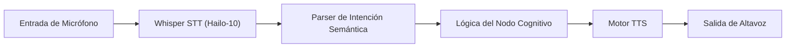

<p align="center">
  
</p>

# 🎙️ HYDRA-UMC-VOICE-UI

<p align="center"><a href="README.md">🇺🇸 English</a> | 🇪🇸 <b>Español</b> | <a href="README_fra.md">🇫🇷 Français</a> | <a href="README_ita.md">🇮🇹 Italiano</a> | <a href="README_deu.md">🇩🇪 Deutsch</a> | <a href="README_zho.md">🇨🇳 简体中文</a> | <a href="README_jpn.md">🇯🇵 日本語</a></p>

### 🔊 Pipeline de Speech-to-Action Local Acelerado por Hardware

<p align="left">
  
  
  
</p>

---

## 1. 🛠️ VISIÓN GENERAL TÉCNICA

**HYDRA-UMC-VOICE-UI** es la capa de interacción por voz local para el ecosistema HYDRA-UMC. Proporciona un pipeline de STT (Speech-to-Text) y TTS (Text-to-Speech) de alto rendimiento acelerado por la NPU Hailo-10.

Permite a los operadores controlar misiones robóticas, consultar el estado del sistema y recibir feedback de audio sin ninguna conectividad a la nube, garantizando la máxima privacidad y latencia cero.

### Características Clave:
* 🎧 **Front-End de Audio (v0):** Carga real de WAV, solo stdlib, y deteccion de actividad de voz por umbral de energia. *(implementado como primitiva real de procesamiento de señal - no la transcripcion en si; ver BUILD Y EJECUCION abajo)*
* 🎙️ **STT en el Borde:** Modelos Whisper cuantizados para transcripción de voz casi instantánea. *(planeado - necesita una dependencia real de modelo)*
* 📢 **TTS Natural:** Síntesis de voz de alta calidad para alertas del sistema e informes de estado. *(planeado)*
* 🧠 **Parser NLU (v0):** Extraccion real de intencion/entidades del texto reconocido, basada en reglas, para el Planificador Semántico. *(implementado como reglas regex sobre un pequeño vocabulario real de comandos - no un modelo de ML entrenado; ver BUILD Y EJECUCION abajo)*
* 🔀 **Clasificación Consciente de Ambigüedad:** `classify_intent()` normaliza el texto (Unicode NFKC, eliminación de muletillas/puntuación) y rechaza una transcripción que realmente coincide con más de un comando conocido en vez de adivinar uno en silencio. *(implementado; usado por el gateway de voz para Watch más abajo)*
* 🛡️ **Cancelación de Ruido:** Optimizado para entornos industriales con alto ruido ambiental. *(planeado)*
* 👨‍👩‍👧 **Hijo del Cognitive AI Node:** Corre como uno de los cuatro
  servicios hermanos bajo [HYDRA-UMC-COGNITIVE-NODE](https://github.com/JuanenRac/HYDRA-UMC-COGNITIVE-NODE)
  (junto a VLA-Engine, Semantic-Planner y Docs-QA), compartiendo la
  imagen HydraOS y los pesos de modelos de su padre en vez de mantener
  copias propias.
* 📦 **Versionado Cuentakilómetros:** Cada build real incrementa
  automáticamente la versión de `pyproject.toml` (`bump_version.py`) - sin
  ediciones manuales de versión.

---

## 2. 🔄 FLUJO DEL PIPELINE DE VOZ



---

## 3. 🧱 ARQUITECTURA Y DECISIONES DE DISEÑO

Este repositorio es un **hijo** de la familia Cognitive AI Node - su
padre, [HYDRA-UMC-COGNITIVE-NODE](https://github.com/JuanenRac/HYDRA-UMC-COGNITIVE-NODE),
posee la imagen HydraOS compartida y los pesos de modelos cuantizados, y
conecta este servicio en su `docker-compose.yml` junto a sus tres
hermanos (VLA-Engine, Semantic-Planner, Docs-QA):

* **Por qué este hijo no tiene hardware/firmware/`os/`/`models/`
  propios.** Corre por completo sobre el módulo CM5 + Hailo-10 M.2 que ya
  posee el padre - centralizar los pesos de modelos y la imagen HydraOS
  en un solo lugar evita cuatro copias divergentes de varios gigabytes
  dentro de la familia.
* **Por qué una estructura `src/`.** Mantiene el paquete instalable
  (`hydra_umc_voice_ui`) separado del tooling en la raíz del repo
  (`bump_version.py`), igual que el resto de proyectos Python del
  ecosistema.
* **Por qué el punto de entrada solo imprime identidad/versión/rol hoy.**
  Esta es la etapa de andamiaje: demostrar que el paquete se instala,
  compila e importa correctamente - en la versión real de Python objetivo
  - es un requisito previo antes de añadir lógica real de pipeline
  STT/TTS, y mantiene ese trabajo posterior aislado de los problemas de
  empaquetado.
* **Cómo encaja en el resto del ecosistema.** Este servicio es la puerta
  de entrada manos-libres a todo el Cognitive AI Node: la intención
  reconocida fluye hacia su hermano HYDRA-UMC-SEMANTIC-PLANNER, y actúa
  como superficie de control por voz junto a HYDRA-UMC-STUDIO y
  HYDRA-UMC-DSI.
* **Por qué `audio.py` usa `wave`/`array` en vez de numpy.** La
  decodificacion PCM de 16 bits y una VAD real por umbral de energia no
  necesitan nada mas alla de lo que ya ofrece la stdlib - mantener v0
  libre de dependencias significa que el front-end de audio real
  funciona en cualquier sitio donde corra Python, antes incluso de
  instalar ninguna dependencia especifica de STT para Hailo-10.
* **Por qué `intent.py` son reglas regex reales, no un modelo NLU
  entrenado.** Un vocabulario de comandos pequeño y real
  (start/stop/status/go home) queda cubierto por completo y de forma
  honesta con reglas hoy - el mismo razonamiento que el indice TF-IDF
  real del hermano HYDRA-UMC-DOCS-QA en vez de un modelo de embeddings:
  un nucleo real y testeable ahora que un futuro clasificador basado en
  ML puede sustituir detras del mismo contrato `parse_intent()`, cuando
  el habla reconocida necesite cubrir mas que este vocabulario de v0.
* **Por qué un audio/texto sin coincidencias devuelve un fallo honesto,
  no una suposición.** `detect_voice_segments()` devuelve una lista
  vacia para el silencio, y `parse_intent()` devuelve `None` para texto
  fuera de su conjunto de reglas - v0 no tiene un modelo de respaldo, asi
  que nunca inventa un segmento o una intencion que en realidad no
  detecto.
* **Por qué el gateway de Watch usa `classify_intent()`, no el
  `parse_intent()` heredado.** `parse_intent()` sigue siendo "primera
  coincidencia gana" (sin cambios, sigue testeado tal cual) para los
  llamantes existentes, pero una transcripción real que realmente
  coincide con más de un comando conocido (por ejemplo, que contiene
  tanto "stop" como "status") es una ambigüedad real y relevante para la
  seguridad en un gateway cuyo trabajo entero es decidir si un comando de
  movimiento necesita confirmación - `classify_intent()` comprueba todas
  las reglas y reporta un caso de ambigüedad real y distinto en vez de
  resolverlo en silencio a cualquiera que sea la regla declarada primero.
* **Por qué `normalize_text()` aplica Unicode NFKC antes de la
  coincidencia.** Algunos pipelines de speech-to-text emiten letras
  latinas de ancho completo y otras formas Unicode de compatibilidad -
  puntos de código distintos de los ASCII normales, y por tanto no son
  "la palabra" en lo que respecta a una expresión regular `\b...\b`.
  NFKC los colapsa primero a su equivalente normal, de modo que un
  comando semánticamente idéntico a una regla conocida nunca se trata
  como un fallo honesto solo por cómo fue codificado.

---

## 📂 ESTRUCTURA DE DIRECTORIOS

```text
HYDRA-UMC-VOICE-UI/
├── src/hydra_umc_voice_ui/
│   ├── audio.py               # Carga real de WAV + deteccion de actividad de voz por energia
│   ├── intent.py               # Parser real de intencion/entidades basado en reglas + classify_intent() consciente de ambigüedad
│   ├── gateway.py               # Puerta de enlace texto-a-intención acotada, compartida por el flujo cognitivo de Watch
│   ├── http_service.py          # Pequeño límite HTTP de stdlib para la ruta de voz Watch-a-cognitivo
│   └── main.py                  # Punto de entrada + subcomandos reales `analyze-audio`/`parse-intent`
├── tests/                    # Tests reales: fixtures WAV, VAD, reglas de intencion, gateway, CLI end-to-end
├── docs/                     # Documentación y catálogo de comandos
├── images/                   # Medios y diagramas
├── deploy/
│   └── voice-ui.env.example  # Plantilla de entorno de la puerta de enlace local en la CM5
├── systemd/
│   └── hydra-umc-voice-ui.service # Unidad systemd del servicio HTTP de voz local en la CM5
├── tools/
│   ├── build_test.py         # Comprobación de compilación sin versionado
│   └── ci_validate.py        # Validación de manifiesto/CHANGELOG/docs usada por CI
├── build/                    # Salida de build local (ignorada por git)
├── pyproject.toml            # Metadatos del paquete (versión con incremento cuentakilómetros)
├── bump_version.py           # Incremento de versión nativa estilo cuentakilómetros (usado por build.sh/.bat)
├── bump_manifest_version.py  # Sincroniza la versión de hydra-umc.project.json con la nativa (--sync)
├── build.sh / build.bat      # Crea el venv, instala (con extras de dev), verifica la importación, corre tests
├── build-test.sh / build-test.bat # Envoltorio no-mutante para tools/build_test.py (no toca version/manifest/CHANGELOG)
└── run.sh / run.bat          # Ejecuta el punto de entrada (reenvia argumentos, ej. `analyze-audio`)
```

> **Nota:** se podaron `hardware/` y `firmware/` - este nodo corre sobre un
> módulo CM5 + Hailo-10 M.2 ya existente, sin diseño de hardware/firmware
> propio. También se podaron `os/` y `models/` - la imagen HydraOS y los
> pesos de modelos Hailo-10 compartidos viven en el proyecto padre
> `HYDRA-UMC-COGNITIVE-NODE`, al que este proyecto se conecta como
> servicio (ver su `docker-compose.yml`).

---

## ⚙️ BUILD Y EJECUCIÓN

Requiere Python >= 3.10.

```bash
# Linux / macOS / Git Bash
./build.sh   # crea .venv, instala el paquete (editable), verifica la importación
./run.sh     # ejecuta el punto de entrada

# Windows (cmd)
build.bat
run.bat
```

`build.sh`/`build.bat` incrementan la versión (estilo cuentakilómetros, ver
`bump_version.py`) antes de cada build real, y corren la suite de tests
real (`pytest tests/`). Salida esperada de un `run.sh` sin argumentos:

```text
HYDRA-UMC-VOICE-UI v0.1.0
Voice UI (Hailo-10) - local STT/TTS pipeline for hands-free robotic mission control.
```

Los subcomandos reales analizan un archivo WAV o parsean texto ya
transcrito:

```bash
./run.sh analyze-audio recordings/command.wav
./run.sh parse-intent "start mission alpha"

# Windows
run.bat analyze-audio recordings\command.wav
run.bat parse-intent "status of robot 3"
```

### 🩺 Solución de problemas

* **`python: comando no encontrado` / el build falla en el paso 1.**
  Requiere Python >= 3.10 en el `PATH`. En Windows, instálalo desde
  [python.org](https://python.org) y marca "Add to PATH" durante la
  instalación; en Linux/macOS suele llamarse `python3`.
* **`build.sh` no consigue activar el venv.** `python3 -m venv .venv`
  coloca el script de activación en una ruta distinta según la
  plataforma: `.venv/bin/activate` en Linux/macOS, `.venv/Scripts/activate`
  en Windows (también con un venv de Python de Windows usado desde Git
  Bash). `build.sh` ya comprueba ambas rutas - si sigue fallando, borra
  `.venv/` y vuelve a ejecutar `./build.sh` para reconstruirlo desde cero.
* **`pip install -e .` falla.** Normalmente por un `.venv/` obsoleto.
  Borra la carpeta `.venv/` y vuelve a ejecutar `./build.sh`/`build.bat`
  para recrearla.
* **`import OK` nunca se imprime.** Significa que `python -c "import
  hydra_umc_voice_ui"` falló - vuelve a ejecutarlo con el venv activo
  para ver el traceback real.

---

## 🎙️ GATEWAY DE VOZ PARA WATCH (v0)

`python -m hydra_umc_voice_ui.main serve` expone un gateway HTTP local y deliberadamente acotado para una integración emparejada con HYDRA-UMC-WATCH: `GET /health` y `POST /v1/voice/turn`. El gateway valida el mensaje tipado `voice_turn`, usa el analizador de intenciones determinista existente y devuelve `assistant_reply`; no controla hardware del robot.

El desarrollo en loopback puede ejecutarse sin token. Una escucha fuera de loopback exige `HYDRA_UMC_VOICE_UI_TOKEN` y una cabecera `Authorization: Bearer` coincidente. Esta API nunca transporta audio en bruto y las intenciones relacionadas con movimiento siempre devuelven `requiresConfirmation: true`.

Una transcripción que realmente coincide con más de un comando conocido se rechaza con una respuesta real y distinta en vez de resolverse en silencio a una sola interpretación:

```json
// POST /v1/voice/turn
{"type": "voice_turn", "requestId": "watch-voice-001", "transcript": "stop the status check", "locale": "en-US"}

// -> {"type":"assistant_reply","requestId":"watch-voice-001","text":"That request matched more than one action (status, stop). Please rephrase it more specifically.","level":"ATTENTION","speak":true,"requiresConfirmation":false,"visualState":"clarification"}
```

Consulta [WATCH_VOICE_GATEWAY.md](docs/WATCH_VOICE_GATEWAY.md) para el contrato de petición completo y el límite de despliegue, y [CLI_REFERENCE.md](docs/CLI_REFERENCE.md) para cada ejemplo real de `analyze-audio`/`parse-intent`/`serve` capturado desde el CLI instalado.

## 🚀 HOJA DE RUTA
* **Fase 1:** Despliegue del motor VLA y procesamiento de entrada multi-modal en Hailo-10.
* **Fase 2:** Integración del planificador semántico con modelos de comportamiento de enjambre y memoria a largo plazo.
* **Fase 3:** Ejecución local de baja latencia de Voice UI y cancelación de ruido industrial.
* **Fase 4:** Soporte multi-idioma (Inglés, Español, Alemán, Francés) e integración total con Dashboard AI.

---

## 🔗 Proyectos Relacionados

Este proyecto es parte del ecosistema de robótica HYDRA-UMC del mismo autor (JuanenRac / Electro Hobby 3D). Vale la pena conocerlo, ya que una petición podría en realidad ser sobre alguno de estos en vez de sobre este repositorio.

**Proyecto Padre**
- **[HYDRA-UMC-COGNITIVE-NODE](https://github.com/JuanenRac/HYDRA-UMC-COGNITIVE-NODE)** — nodo de integración para el pipeline cognitivo Hailo-10 (orquestación de LLM/VLA/voz); el padre del que este repositorio es una etapa o consumidor específico, dentro de su propio pipeline cognitivo.

**Proyectos Hermanos** — las demás etapas/consumidores del propio pipeline cognitivo Hailo-10 de HYDRA-UMC-COGNITIVE-NODE
- **[HYDRA-UMC-SEMANTIC-PLANNER](https://github.com/JuanenRac/HYDRA-UMC-SEMANTIC-PLANNER)** — descomposición real de tareas basada en reglas y recuperación semántica de errores sobre códigos de error del MCU.
- **[HYDRA-UMC-VLA-ENGINE](https://github.com/JuanenRac/HYDRA-UMC-VLA-ENGINE)** — codificación/decodificación real de tokens de acción y generación de trayectoria para un modelo Vision-Language-Action.
- **[HYDRA-UMC-DOCS-QA](https://github.com/JuanenRac/HYDRA-UMC-DOCS-QA)** — búsqueda real de documentos TF-IDF (solo librería estándar) sobre los propios documentos Markdown de este ecosistema.

**Directamente Relacionados**
- **[HYDRA-UMC-STUDIO](https://github.com/JuanenRac/HYDRA-UMC-STUDIO)** — panel de control web con visualización 3D multi-robot en tiempo real; otra superficie de control por voz del ecosistema, junto a este servicio.
- **[HYDRA-UMC-DSI](https://github.com/JuanenRac/HYDRA-UMC-DSI)** — interfaz táctil nativa para la pantalla táctil DSI de 7" a bordo, embebida en el propio CM5; otra superficie de control por voz del ecosistema, junto a este servicio.

**También Forma Parte del Ecosistema**

*Hardware y Plataforma Base*
- **[HYDRA-UMC](https://github.com/JuanenRac/HYDRA-UMC)** — la placa madre física del brazo robótico: host CM5 + coprocesador STM32H745 de doble núcleo, coordinando hasta 8 brazos herramienta por CAN-OTA/SPI-OTA.
- **[HYDRA-UMC-OS](https://github.com/JuanenRac/HYDRA-UMC-OS)** — capa de producto reproducible sobre Raspberry Pi OS para el CM5: agente de solo lectura, config/perfiles validados, aprovisionamiento WiFi de primer contacto.
- **[HYDRA-UMC-SDK](https://github.com/JuanenRac/HYDRA-UMC-SDK)** — el contrato JSON-Schema compartido y la barrera de seguridad contra la que cada bridge valida sus comandos.

*Backend Central y Clientes*
- **[HYDRA-UMC-SERVER](https://github.com/JuanenRac/HYDRA-UMC-SERVER)** — el backend headless real (REST/WebSocket) con el que habla de verdad cada cliente de control.
- **[HYDRA-UMC-SUITE](https://github.com/JuanenRac/HYDRA-UMC-SUITE)** — centro de mando de enjambre de escritorio (PySide6) para varios servidores a la vez, empaquetado como ejecutable independiente.
- **[HYDRA-UMC-ANDROID-CONTROL](https://github.com/JuanenRac/HYDRA-UMC-ANDROID-CONTROL)** — app nativa de control para Android con inicio de sesión biométrico y un compañero Wear OS emparejado.
- **[HYDRA-UMC-IOS-CONTROL](https://github.com/JuanenRac/HYDRA-UMC-IOS-CONTROL)** — app de control para iOS/iPadOS (Flutter) con sincronización en tiempo real por WebSocket.
- **[HYDRA-UMC-EDITOR-URDF](https://github.com/JuanenRac/HYDRA-UMC-EDITOR-URDF)** — creador/editor gráfico de URDF de escritorio que envía los modelos terminados al propio catálogo de STUDIO.
- **[HYDRA-UMC-BRIDGE-AMR](https://github.com/JuanenRac/HYDRA-UMC-BRIDGE-AMR)** — barrera de coordinación para flotas AGV/AMR mediante un publicador MQTT VDA 5050 real.
- **[HYDRA-UMC-BRIDGE-CNC](https://github.com/JuanenRac/HYDRA-UMC-BRIDGE-CNC)** — coordinador de alto nivel para celdas CNC con acceso real a estado/bytes de control GRBL.
- **[HYDRA-UMC-BRIDGE-DROIDS](https://github.com/JuanenRac/HYDRA-UMC-BRIDGE-DROIDS)** — barrera de coordinación para droides con patas/humanoides, con un emisor de comandos real para Boston Dynamics Spot.
- **[HYDRA-UMC-BRIDGE-LASER](https://github.com/JuanenRac/HYDRA-UMC-BRIDGE-LASER)** — coordinador de seguridad para celdas láser que lee 3 salvaguardas GPIO reales de llave/carcasa/enclavamiento.
- **[HYDRA-UMC-BRIDGE-OPENPNP](https://github.com/JuanenRac/HYDRA-UMC-BRIDGE-OPENPNP)** — coordinador de alto nivel seguro para el flujo de placas de pick-and-place OpenPnP.
- **[HYDRA-UMC-BRIDGE-PRINTER3D](https://github.com/JuanenRac/HYDRA-UMC-BRIDGE-PRINTER3D)** — barrera de coordinación segura para impresoras 3D Moonraker/Klipper, con comandos de trabajo reales y controlados.
- **[HYDRA-UMC-BRIDGE-ROS2](https://github.com/JuanenRac/HYDRA-UMC-BRIDGE-ROS2)** — coordinador de seguridad con un transporte ROS 2 rclpy real, importado de forma perezosa.
- **[HYDRA-UMC-BRIDGE-UAV](https://github.com/JuanenRac/HYDRA-UMC-BRIDGE-UAV)** — barrera de coordinación para UAV equipados con cámara, con un emisor de comandos MAVLink real.

*Plataforma de Herramientas URTC*
- **[URTC](https://github.com/JuanenRac/URTC)** — firmware para la placa física del Universal Robot Tool Controller, más de 25 perfiles de herramienta por bus CAN.
- **[URTC-FLASHER](https://github.com/JuanenRac/URTC-FLASHER)** — herramienta de escritorio con GUI para flashear placas URTC, CAN-OTA más SWD/JTAG de chip completo.
- **[URTC-TESTER](https://github.com/JuanenRac/URTC-TESTER)** — herramienta de escritorio de diagnóstico CAN-bus en vivo para placas URTC, un panel por perfil de herramienta.
- **[URTC-WEB-STUDIO](https://github.com/JuanenRac/URTC-WEB-STUDIO)** — alternativa basada en navegador a URTC-TESTER mediante la Web Serial API, sin instalación local.

*Nodo IA de Visión (Hailo-8)*
- **[HYDRA-UMC-VISION-NODE](https://github.com/JuanenRac/HYDRA-UMC-VISION-NODE)** — nodo de integración para el pipeline de visión Hailo-8, con una comprobación real de disponibilidad de hardware por etapa.
- **[HYDRA-UMC-DETECTION-HEF](https://github.com/JuanenRac/HYDRA-UMC-DETECTION-HEF)** — registro real de modelos compilados con verificación de carga segura por arquitectura Hailo/checksum.
- **[HYDRA-UMC-VISION-STREAMER](https://github.com/JuanenRac/HYDRA-UMC-VISION-STREAMER)** — generador real de pipeline GStreamer + config MediaMTX, con una frontera de integración HailoRT real.
- **[HYDRA-UMC-VISUAL-SERVOING-API](https://github.com/JuanenRac/HYDRA-UMC-VISUAL-SERVOING-API)** — ley de corrección real de Position-Based Visual Servoing, con puerta de seguridad según el estado de zona previo.
- **[HYDRA-UMC-SAFETY-ZONES](https://github.com/JuanenRac/HYDRA-UMC-SAFETY-ZONES)** — comprobación real de invasión de zona y solicitud de E-STOP, con exigencia de vigencia de calibración.

*Orquestación y Enjambre*
- **[HYDRA-UMC-ORCHESTRATOR](https://github.com/JuanenRac/HYDRA-UMC-ORCHESTRATOR)** — nodo de integración con un contrato real de informe de salud gRPC/Protobuf y una máquina de estados de misión.
- **[HYDRA-UMC-JOB-DISPATCHER](https://github.com/JuanenRac/HYDRA-UMC-JOB-DISPATCHER)** — cola de trabajos real basada en prioridad con deduplicación, sobre una API HTTP real.
- **[HYDRA-UMC-NODE-HEALING](https://github.com/JuanenRac/HYDRA-UMC-NODE-HEALING)** — watchdog de salud de flota real basado en gRPC, con reintento/backoff y detección de discrepancia de identidad.
- **[HYDRA-UMC-PATH-PLANNER-3D](https://github.com/JuanenRac/HYDRA-UMC-PATH-PLANNER-3D)** — planificador de rutas 3D real basado en RRT, con validación real de colisión de obstáculos/espacio de trabajo.
- **[HYDRA-UMC-SWARM-SYNC](https://github.com/JuanenRac/HYDRA-UMC-SWARM-SYNC)** — sincronización de estado real mediante CRDT LWW-Element-Map, con pruebas de propiedades para convergencia multi-celda.

*Gemelo Digital y Simulación*
- **[HYDRA-UMC-TWIN](https://github.com/JuanenRac/HYDRA-UMC-TWIN)** — nodo de integración para el motor de gemelo digital, con un contrato real de sincronización por compatibilidad de versión.
- **[HYDRA-UMC-HIL-BRIDGE](https://github.com/JuanenRac/HYDRA-UMC-HIL-BRIDGE)** — enclavamiento de seguridad real hardware-in-the-loop que enruta comandos entre simulación y hardware real.
- **[HYDRA-UMC-PHYSICS-REPLICA](https://github.com/JuanenRac/HYDRA-UMC-PHYSICS-REPLICA)** — cinemática directa real y validación de límites articulares sobre un subconjunto real de URDF.
- **[HYDRA-UMC-SYNTHETIC-DATA-GEN](https://github.com/JuanenRac/HYDRA-UMC-SYNTHETIC-DATA-GEN)** — generador real de escenas 2D procedurales con exportación de anotaciones YOLO/COCO.

*Datos y Analítica*
- **[HYDRA-UMC-DATALAKE](https://github.com/JuanenRac/HYDRA-UMC-DATALAKE)** — almacén de series temporales real respaldado por sqlite3, con una API HTTP real de ingesta/consulta.
- **[HYDRA-UMC-ANOMALY-DETECTOR](https://github.com/JuanenRac/HYDRA-UMC-ANOMALY-DETECTOR)** — detector de anomalías real basado en FFT + línea base estadística, con monitorización de deriva.
- **[HYDRA-UMC-PRODUCTION-REPORTS](https://github.com/JuanenRac/HYDRA-UMC-PRODUCTION-REPORTS)** — cálculo real de OEE/disponibilidad sobre el histórico de DATALAKE, con exportación CSV reproducible.
- **[HYDRA-UMC-TELEMETRY-COLLECTOR](https://github.com/JuanenRac/HYDRA-UMC-TELEMETRY-COLLECTOR)** — pipeline real de ingesta CAN/WebSocket hacia DATALAKE, con deduplicación por secuencia.

*Pasarela Industrial*
- **[HYDRA-UMC-GATEWAY-INDUSTRIAL](https://github.com/JuanenRac/HYDRA-UMC-GATEWAY-INDUSTRIAL)** — nodo de integración que retransmite a protocolos industriales, con una capa real de lista blanca de comandos/contrapresión.
- **[HYDRA-UMC-OPCUA-SERVER](https://github.com/JuanenRac/HYDRA-UMC-OPCUA-SERVER)** — espacio de direcciones OPC-UA real, verificado con una sesión de cliente real del protocolo binario.
- **[HYDRA-UMC-MQTT-BROKER](https://github.com/JuanenRac/HYDRA-UMC-MQTT-BROKER)** — broker MQTT real con autenticación por cliente opcional y ACL de tópicos.
- **[HYDRA-UMC-MTCONNECT-ADAPTER](https://github.com/JuanenRac/HYDRA-UMC-MTCONNECT-ADAPTER)** — endpoints XML reales `/probe` y `/current` de MTConnect, con salida en modo degradado.

*Herramientas Complementarias y Operaciones del Ecosistema*
- **[HYDRA-UMC-DASHBOARD-AI](https://github.com/JuanenRac/HYDRA-UMC-DASHBOARD-AI)** — paneles de Resúmenes Inteligentes y Resaltado de Anomalías sobre DATALAKE/ANOMALY-DETECTOR, con un respaldo estadístico honesto.
- **[HYDRA-UMC-TOOL-CLI](https://github.com/JuanenRac/HYDRA-UMC-TOOL-CLI)** — CLI de flota con un contrato real y estable de códigos de salida, cliente real y en vivo de la propia API de HYDRA-UMC-SERVER.
- **[HYDRA-UMC-WATCH](https://github.com/JuanenRac/HYDRA-UMC-WATCH)** — app compañera de WearOS con alertas hápticas reales y un relé de voz al teléfono emparejado.
- **[URTC-SMART-RACK](https://github.com/JuanenRac/URTC-SMART-RACK)** — firmware para un rack de montaje de placas con decodificación real de ID de herramienta y lógica de precalentamiento Smart Idle.
- **[URTC-VISION-TOOL](https://github.com/JuanenRac/URTC-VISION-TOOL)** — firmware más un compañero de visión real en Python para un cabezal de inspección térmica/RGB.
- **[HYDRA-UMC-UPDATER](https://github.com/JuanenRac/HYDRA-UMC-UPDATER)** — herramienta administrativa de escritorio que descubre, clona y actualiza cada repositorio de este ecosistema.
- **[HYDRA-UMC-OS-REBUILDER](https://github.com/JuanenRac/HYDRA-UMC-OS-REBUILDER)** — herramienta de escritorio Windows/Linux que construye una imagen de la CM5 lista para grabar, precargada con las versiones más actuales del ecosistema, con configuración de primer arranque de Wi-Fi/usuario/SSH al estilo de Raspberry Pi Imager.

---

## 📚 Documentación y Comunidad

- **[CONTRIBUTING.md](CONTRIBUTING.md)** — stack tecnológico y pautas de codificación para un pull request.
- **[CODE_OF_CONDUCT.md](CODE_OF_CONDUCT.md)** — los estándares de comportamiento esperados en esta comunidad.
- **[SECURITY.md](SECURITY.md)** — cómo reportar una vulnerabilidad, y las áreas reales de enfoque en seguridad de este proyecto.
- **[SUPPORT.md](SUPPORT.md)** — dónde hacer preguntas y reportar errores.
- **[LICENSE.md](LICENSE.md)** — la licencia propia de este proyecto.

## 👤 AUTOR
**JuanenRac** (Electro Hobby 3D)
📧 electrohobby3d@gmail.com
📺 [youtube.com/@electrohobby3d](https://youtube.com/@electrohobby3d)

## 📜 LICENCIA
GPL-3.0 - Ver archivo LICENSE para más detalles.
