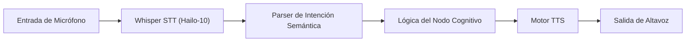

<p align="center">
  
</p>

# 🎙️ HYDRA-UMC-VOICE-UI

<p align="center"><a href="README.md">🇺🇸 English</a> | 🇪🇸 <b>Español</b> | <a href="README_fra.md">🇫🇷 Français</a> | <a href="README_ita.md">🇮🇹 Italiano</a> | <a href="README_deu.md">🇩🇪 Deutsch</a> | <a href="README_zho.md">🇨🇳 简体中文</a> | <a href="README_jpn.md">🇯🇵 日本語</a></p>

### 🔊 Pipeline de Speech-to-Action Local Acelerado por Hardware

<p align="left">
  
  
  
</p>

---

## 1. 🛠️ VISIÓN GENERAL TÉCNICA

**HYDRA-UMC-VOICE-UI** es la capa de interacción por voz local para el ecosistema HYDRA-UMC. Proporciona un pipeline de STT (Speech-to-Text) y TTS (Text-to-Speech) de alto rendimiento acelerado por la NPU Hailo-10.

Permite a los operadores controlar misiones robóticas, consultar el estado del sistema y recibir feedback de audio sin ninguna conectividad a la nube, garantizando la máxima privacidad y latencia cero.

### Características Clave:
* 🎧 **Front-End de Audio (v0):** Carga real de WAV, solo stdlib, y deteccion de actividad de voz por umbral de energia. *(implementado como primitiva real de procesamiento de señal - no la transcripcion en si; ver BUILD Y EJECUCION abajo)*
* 🎙️ **STT en el Borde:** Modelos Whisper cuantizados para transcripción de voz casi instantánea. *(planeado - necesita una dependencia real de modelo)*
* 📢 **TTS Natural:** Síntesis de voz de alta calidad para alertas del sistema e informes de estado. *(planeado)*
* 🧠 **Parser NLU (v0):** Extraccion real de intencion/entidades del texto reconocido, basada en reglas, para el Planificador Semántico. *(implementado como reglas regex sobre un pequeño vocabulario real de comandos - no un modelo de ML entrenado; ver BUILD Y EJECUCION abajo)*
* 🔀 **Clasificación Consciente de Ambigüedad:** `classify_intent()` normaliza el texto (Unicode NFKC, eliminación de muletillas/puntuación) y rechaza una transcripción que realmente coincide con más de un comando conocido en vez de adivinar uno en silencio. *(implementado; usado por el gateway de voz para Watch más abajo)*
* 🛡️ **Cancelación de Ruido:** Optimizado para entornos industriales con alto ruido ambiental. *(planeado)*
* 👨‍👩‍👧 **Hijo del Cognitive AI Node:** Corre como uno de los cuatro
  servicios hermanos bajo [HYDRA-UMC-COGNITIVE-NODE](https://github.com/JuanenRac/HYDRA-UMC-COGNITIVE-NODE)
  (junto a VLA-Engine, Semantic-Planner y Docs-QA), compartiendo la
  imagen HydraOS y los pesos de modelos de su padre en vez de mantener
  copias propias.
* 📦 **Versionado Cuentakilómetros:** Cada build real incrementa
  automáticamente la versión de `pyproject.toml` (`bump_version.py`) - sin
  ediciones manuales de versión.

---

## 2. 🔄 FLUJO DEL PIPELINE DE VOZ



---

## 3. 🧱 ARQUITECTURA Y DECISIONES DE DISEÑO

Este repositorio es un **hijo** de la familia Cognitive AI Node - su
padre, [HYDRA-UMC-COGNITIVE-NODE](https://github.com/JuanenRac/HYDRA-UMC-COGNITIVE-NODE),
posee la imagen HydraOS compartida y los pesos de modelos cuantizados, y
conecta este servicio en su `docker-compose.yml` junto a sus tres
hermanos (VLA-Engine, Semantic-Planner, Docs-QA):

* **Por qué este hijo no tiene hardware/firmware/`os/`/`models/`
  propios.** Corre por completo sobre el módulo CM5 + Hailo-10 M.2 que ya
  posee el padre - centralizar los pesos de modelos y la imagen HydraOS
  en un solo lugar evita cuatro copias divergentes de varios gigabytes
  dentro de la familia.
* **Por qué una estructura `src/`.** Mantiene el paquete instalable
  (`hydra_umc_voice_ui`) separado del tooling en la raíz del repo
  (`bump_version.py`), igual que el resto de proyectos Python del
  ecosistema.
* **Por qué el punto de entrada solo imprime identidad/versión/rol hoy.**
  Esta es la etapa de andamiaje: demostrar que el paquete se instala,
  compila e importa correctamente - en la versión real de Python objetivo
  - es un requisito previo antes de añadir lógica real de pipeline
  STT/TTS, y mantiene ese trabajo posterior aislado de los problemas de
  empaquetado.
* **Cómo encaja en el resto del ecosistema.** Este servicio es la puerta
  de entrada manos-libres a todo el Cognitive AI Node: la intención
  reconocida fluye hacia su hermano HYDRA-UMC-SEMANTIC-PLANNER, y actúa
  como superficie de control por voz junto a HYDRA-UMC-STUDIO y
  HYDRA-UMC-DSI.
* **Por qué `audio.py` usa `wave`/`array` en vez de numpy.** La
  decodificacion PCM de 16 bits y una VAD real por umbral de energia no
  necesitan nada mas alla de lo que ya ofrece la stdlib - mantener v0
  libre de dependencias significa que el front-end de audio real
  funciona en cualquier sitio donde corra Python, antes incluso de
  instalar ninguna dependencia especifica de STT para Hailo-10.
* **Por qué `intent.py` son reglas regex reales, no un modelo NLU
  entrenado.** Un vocabulario de comandos pequeño y real
  (start/stop/status/go home) queda cubierto por completo y de forma
  honesta con reglas hoy - el mismo razonamiento que el indice TF-IDF
  real del hermano HYDRA-UMC-DOCS-QA en vez de un modelo de embeddings:
  un nucleo real y testeable ahora que un futuro clasificador basado en
  ML puede sustituir detras del mismo contrato `parse_intent()`, cuando
  el habla reconocida necesite cubrir mas que este vocabulario de v0.
* **Por qué un audio/texto sin coincidencias devuelve un fallo honesto,
  no una suposición.** `detect_voice_segments()` devuelve una lista
  vacia para el silencio, y `parse_intent()` devuelve `None` para texto
  fuera de su conjunto de reglas - v0 no tiene un modelo de respaldo, asi
  que nunca inventa un segmento o una intencion que en realidad no
  detecto.
* **Por qué el gateway de Watch usa `classify_intent()`, no el
  `parse_intent()` heredado.** `parse_intent()` sigue siendo "primera
  coincidencia gana" (sin cambios, sigue testeado tal cual) para los
  llamantes existentes, pero una transcripción real que realmente
  coincide con más de un comando conocido (por ejemplo, que contiene
  tanto "stop" como "status") es una ambigüedad real y relevante para la
  seguridad en un gateway cuyo trabajo entero es decidir si un comando de
  movimiento necesita confirmación - `classify_intent()` comprueba todas
  las reglas y reporta un caso de ambigüedad real y distinto en vez de
  resolverlo en silencio a cualquiera que sea la regla declarada primero.
* **Por qué `normalize_text()` aplica Unicode NFKC antes de la
  coincidencia.** Algunos pipelines de speech-to-text emiten letras
  latinas de ancho completo y otras formas Unicode de compatibilidad -
  puntos de código distintos de los ASCII normales, y por tanto no son
  "la palabra" en lo que respecta a una expresión regular `\b...\b`.
  NFKC los colapsa primero a su equivalente normal, de modo que un
  comando semánticamente idéntico a una regla conocida nunca se trata
  como un fallo honesto solo por cómo fue codificado.

---

## 📂 ESTRUCTURA DE DIRECTORIOS

```text
HYDRA-UMC-VOICE-UI/
├── src/hydra_umc_voice_ui/
│   ├── audio.py               # Carga real de WAV + deteccion de actividad de voz por energia
│   ├── intent.py               # Parser real de intencion/entidades basado en reglas + classify_intent() consciente de ambigüedad
│   └── main.py                  # Punto de entrada + subcomandos reales `analyze-audio`/`parse-intent`
├── tests/                    # Tests reales: fixtures WAV, VAD, reglas de intencion, CLI end-to-end
├── docs/                     # Documentación y catálogo de comandos
├── images/                   # Medios y diagramas
├── scripts/                  # Scripts de utilidad
├── build/                    # Salida de build local (ignorada por git)
├── pyproject.toml            # Metadatos del paquete (versión 0.0.5, incremento cuentakilómetros)
├── bump_version.py           # Incremento de versión estilo cuentakilómetros (usado por build.sh/.bat)
├── build.sh / build.bat      # Crea el venv, instala (con extras de dev), verifica la importación, corre tests
└── run.sh / run.bat          # Ejecuta el punto de entrada (reenvia argumentos, ej. `analyze-audio`)
```

> **Nota:** se podaron `hardware/` y `firmware/` - este nodo corre sobre un
> módulo CM5 + Hailo-10 M.2 ya existente, sin diseño de hardware/firmware
> propio. También se podaron `os/` y `models/` - la imagen HydraOS y los
> pesos de modelos Hailo-10 compartidos viven en el proyecto padre
> `HYDRA-UMC-COGNITIVE-NODE`, al que este proyecto se conecta como
> servicio (ver su `docker-compose.yml`).

---

## ⚙️ BUILD Y EJECUCIÓN

Requiere Python >= 3.10.

```bash
# Linux / macOS / Git Bash
./build.sh   # crea .venv, instala el paquete (editable), verifica la importación
./run.sh     # ejecuta el punto de entrada

# Windows (cmd)
build.bat
run.bat
```

`build.sh`/`build.bat` incrementan la versión (estilo cuentakilómetros, ver
`bump_version.py`) antes de cada build real, y corren la suite de tests
real (`pytest tests/`). Salida esperada de un `run.sh` sin argumentos:

```text
HYDRA-UMC-VOICE-UI v0.0.5
Voice UI (Hailo-10) - local STT/TTS pipeline for hands-free robotic mission control.
```

Los subcomandos reales analizan un archivo WAV o parsean texto ya
transcrito:

```bash
./run.sh analyze-audio recordings/command.wav
./run.sh parse-intent "start mission alpha"

# Windows
run.bat analyze-audio recordings\command.wav
run.bat parse-intent "status of robot 3"
```

### 🩺 Solución de problemas

* **`python: comando no encontrado` / el build falla en el paso 1.**
  Requiere Python >= 3.10 en el `PATH`. En Windows, instálalo desde
  [python.org](https://python.org) y marca "Add to PATH" durante la
  instalación; en Linux/macOS suele llamarse `python3`.
* **`build.sh` no consigue activar el venv.** `python3 -m venv .venv`
  coloca el script de activación en una ruta distinta según la
  plataforma: `.venv/bin/activate` en Linux/macOS, `.venv/Scripts/activate`
  en Windows (también con un venv de Python de Windows usado desde Git
  Bash). `build.sh` ya comprueba ambas rutas - si sigue fallando, borra
  `.venv/` y vuelve a ejecutar `./build.sh` para reconstruirlo desde cero.
* **`pip install -e .` falla.** Normalmente por un `.venv/` obsoleto.
  Borra la carpeta `.venv/` y vuelve a ejecutar `./build.sh`/`build.bat`
  para recrearla.
* **`import OK` nunca se imprime.** Significa que `python -c "import
  hydra_umc_voice_ui"` falló - vuelve a ejecutarlo con el venv activo
  para ver el traceback real.

---

## 🎙️ GATEWAY DE VOZ PARA WATCH (v0)

`python -m hydra_umc_voice_ui.main serve` expone un gateway HTTP local y deliberadamente acotado para una integración emparejada con HYDRA-UMC-WATCH: `GET /health` y `POST /v1/voice/turn`. El gateway valida el mensaje tipado `voice_turn`, usa el analizador de intenciones determinista existente y devuelve `assistant_reply`; no controla hardware del robot.

El desarrollo en loopback puede ejecutarse sin token. Una escucha fuera de loopback exige `HYDRA_UMC_VOICE_UI_TOKEN` y una cabecera `Authorization: Bearer` coincidente. Esta API nunca transporta audio en bruto y las intenciones relacionadas con movimiento siempre devuelven `requiresConfirmation: true`.

Una transcripción que realmente coincide con más de un comando conocido se rechaza con una respuesta real y distinta en vez de resolverse en silencio a una sola interpretación:

```json
{"transcript": "stop the status check"}
// -> {"text": "That request matched more than one action (status, stop). Please rephrase it more specifically.", "requiresConfirmation": false, "intent": null}
```

Consulta [WATCH_VOICE_GATEWAY.md](docs/WATCH_VOICE_GATEWAY.md) para el contrato de petición y el límite de despliegue.

## 🚀 HOJA DE RUTA
* **Fase 1:** Despliegue del motor VLA y procesamiento de entrada multi-modal en Hailo-10.
* **Fase 2:** Integración del planificador semántico con modelos de comportamiento de enjambre y memoria a largo plazo.
* **Fase 3:** Ejecución local de baja latencia de Voice UI y cancelación de ruido industrial.
* **Fase 4:** Soporte multi-idioma (Inglés, Español, Alemán, Francés) e integración total con Dashboard AI.

---

## 🔗 PROYECTOS RELACIONADOS

Este proyecto forma parte de un ecosistema de robótica más amplio del mismo autor (JuanenRac / Electro Hobby 3D), que abarca firmware, software de control, nodos de IA y herramientas de flota.

### Directamente relacionados con este servicio

- **[HYDRA-UMC-STUDIO](https://github.com/JuanenRac/HYDRA-UMC-STUDIO)** / **[HYDRA-UMC-DSI](https://github.com/JuanenRac/HYDRA-UMC-DSI)** — otras superficies de control por voz del ecosistema.

### Resto del ecosistema

**Plataforma HYDRA-UMC** — la micro-fábrica multi-robot
- **[HYDRA-UMC](https://github.com/JuanenRac/HYDRA-UMC)** — la placa base: host Raspberry Pi CM5 + coprocesador de tiempo real STM32H745 de doble núcleo, orquestando hasta 8 brazos robóticos distribuidos vía CAN-OTA/SPI-OTA.
- **[HYDRA-UMC SERVER](https://github.com/JuanenRac/HYDRA-UMC-SERVER)** — backend Express/WebSocket headless que posee el estado de los robots.
- **[HYDRA-UMC-ANDROID-CONTROL](https://github.com/JuanenRac/HYDRA-UMC-ANDROID-CONTROL)** — app Android de control para HYDRA-UMC.
- **[HYDRA-UMC-IOS-CONTROL](https://github.com/JuanenRac/HYDRA-UMC-IOS-CONTROL)** — app iOS/iPadOS de control para HYDRA-UMC.
- **[HYDRA-UMC-SUITE](https://github.com/JuanenRac/HYDRA-UMC-SUITE)** — centro de mando de escritorio para el enjambre.
- **[HYDRA-UMC-EDITOR-URDF](https://github.com/JuanenRac/HYDRA-UMC-EDITOR-URDF)** — creador/editor gráfico de escritorio para modelos URDF.

**Plataforma URTC** — el controlador de cabezal de herramienta que lleva cada brazo HYDRA-UMC
- **[URTC](https://github.com/JuanenRac/URTC)** — Universal Robot Tool Controller, firmware.
- **[URTC Flasher](https://github.com/JuanenRac/URTC-FLASHER)** — herramienta de escritorio de flasheo CAN-OTA + SWD/JTAG.
- **[URTC Tester](https://github.com/JuanenRac/URTC-TESTER)** — herramienta de escritorio de diagnóstico CAN en vivo.
- **[URTC Web Studio](https://github.com/JuanenRac/URTC-WEB-STUDIO)** — alternativa basada en navegador a las 2 herramientas de escritorio anteriores.

**👁️ Vision AI Node (Hailo-8)**
- [HYDRA-UMC-VISION-NODE](https://github.com/JuanenRac/HYDRA-UMC-VISION-NODE)
- [HYDRA-UMC-VISION-STREAMER](https://github.com/JuanenRac/HYDRA-UMC-VISION-STREAMER)
- [HYDRA-UMC-DETECTION-HEF](https://github.com/JuanenRac/HYDRA-UMC-DETECTION-HEF)
- [HYDRA-UMC-SAFETY-ZONES](https://github.com/JuanenRac/HYDRA-UMC-SAFETY-ZONES)
- [HYDRA-UMC-VISUAL-SERVOING-API](https://github.com/JuanenRac/HYDRA-UMC-VISUAL-SERVOING-API)

**🐝 Orchestration & Swarm**
- [HYDRA-UMC-ORCHESTRATOR](https://github.com/JuanenRac/HYDRA-UMC-ORCHESTRATOR)
- [HYDRA-UMC-SWARM-SYNC](https://github.com/JuanenRac/HYDRA-UMC-SWARM-SYNC)
- [HYDRA-UMC-PATH-PLANNER-3D](https://github.com/JuanenRac/HYDRA-UMC-PATH-PLANNER-3D)
- [HYDRA-UMC-JOB-DISPATCHER](https://github.com/JuanenRac/HYDRA-UMC-JOB-DISPATCHER)
- [HYDRA-UMC-NODE-HEALING](https://github.com/JuanenRac/HYDRA-UMC-NODE-HEALING)

**🎮 Digital Twin & Simulation**
- [HYDRA-UMC-TWIN](https://github.com/JuanenRac/HYDRA-UMC-TWIN)
- [HYDRA-UMC-PHYSICS-REPLICA](https://github.com/JuanenRac/HYDRA-UMC-PHYSICS-REPLICA)
- [HYDRA-UMC-HIL-BRIDGE](https://github.com/JuanenRac/HYDRA-UMC-HIL-BRIDGE)
- [HYDRA-UMC-SYNTHETIC-DATA-GEN](https://github.com/JuanenRac/HYDRA-UMC-SYNTHETIC-DATA-GEN)

**📊 Data & Analytics**
- [HYDRA-UMC-DATALAKE](https://github.com/JuanenRac/HYDRA-UMC-DATALAKE)
- [HYDRA-UMC-TELEMETRY-COLLECTOR](https://github.com/JuanenRac/HYDRA-UMC-TELEMETRY-COLLECTOR)
- [HYDRA-UMC-ANOMALY-DETECTOR](https://github.com/JuanenRac/HYDRA-UMC-ANOMALY-DETECTOR)
- [HYDRA-UMC-PRODUCTION-REPORTS](https://github.com/JuanenRac/HYDRA-UMC-PRODUCTION-REPORTS)

**🏭 Industrial Gateway**
- [HYDRA-UMC-GATEWAY-INDUSTRIAL](https://github.com/JuanenRac/HYDRA-UMC-GATEWAY-INDUSTRIAL)
- [HYDRA-UMC-OPCUA-SERVER](https://github.com/JuanenRac/HYDRA-UMC-OPCUA-SERVER)
- [HYDRA-UMC-MQTT-BROKER](https://github.com/JuanenRac/HYDRA-UMC-MQTT-BROKER)
- [HYDRA-UMC-MTCONNECT-ADAPTER](https://github.com/JuanenRac/HYDRA-UMC-MTCONNECT-ADAPTER)

**🛠️ Complementary Tools**
- [URTC-SMART-RACK](https://github.com/JuanenRac/URTC-SMART-RACK)
- [URTC-VISION-TOOL](https://github.com/JuanenRac/URTC-VISION-TOOL)
- [HYDRA-UMC-WATCH](https://github.com/JuanenRac/HYDRA-UMC-WATCH)
- [HYDRA-UMC-TOOL-CLI](https://github.com/JuanenRac/HYDRA-UMC-TOOL-CLI)
- [HYDRA-UMC-DASHBOARD-AI](https://github.com/JuanenRac/HYDRA-UMC-DASHBOARD-AI)

---

## 👤 AUTOR
**JuanenRac** (Electro Hobby 3D)
📧 electrohobby3d@gmail.com

## 📜 LICENCIA
GPL-3.0 - Ver archivo LICENSE para más detalles.
